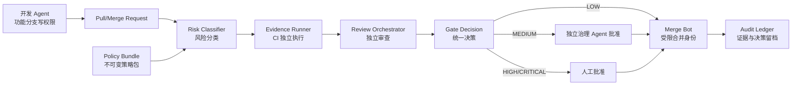

# AgentGate 全 AI 开发风险控制设计

> 状态：Draft，待审核，不作为当前实现承诺  
> 版本：v0.1  
> 日期：2026-07-22  
> 适用范围：使用 AI agent 完成编码、测试、审查和合并的 GitHub/GitLab 仓库

## 1. 决策摘要

本设计在 AgentGate 现有风险扫描、MR 描述校验、测试痕迹和受影响 Go 测试之上，增加三项系统级控制：

1. **不可篡改的策略**：普通业务变更不能同时修改或绕过用于审查自己的策略、门禁程序和合并规则。
2. **CI 独立证据**：合并判断只采信 CI 针对当前提交独立生成的证据，不采信 agent 手写的 `Tested: pass` 作为通过依据。
3. **职责与权限分离**：实现、验证、审查、批准和合并由不同身份与权限执行，避免单一 agent 自写、自测、自批、自合并。

三项控制不对所有变更一刀切。系统按风险分为快速、标准和严格三条路径：低风险变更继续自动快速合并；只有高风险变更才要求更重的验证或人工批准。

核心设计判断：**代码可以全部由 AI agent 开发，但控制策略和最终授权不能由同一个开发身份自由改写。**

## 2. 背景与问题

AgentGate 当前已经能够：

- 扫描新增代码中的已知风险模式；
- 要求风险注解包含原因、owner 和复查日期；
- 检查 MR 描述完整性；
- 记录本地测试痕迹，并将证据绑定到 Git 状态；
- 在 Go 仓库中执行受影响包测试；
- 扫描本次变更引入的密钥。

这些能力解决了“明显违规”和“没有留下说明”的问题，但在全 AI 开发场景中仍存在三个信任缺口：

- 同一个 agent 可以修改业务代码，同时修改扫描器、配置或 CI，使门禁失效；
- 非 Go 仓库的 CI 主要读取 `Tested:` trailer，不能独立证明测试命令真实执行且覆盖本次变更；
- 风险注解和 `scan:ignore` 由提交者自行填写，没有独立批准身份和授权凭证。

因此，当前 AgentGate 更接近“治理辅助工具”，本设计目标是把它升级为“可支撑 AI 自主开发的风险控制系统”。

## 3. 目标与非目标

### 3.1 目标

- 普通 agent 无法在同一个变更中降低审查自己的门禁强度。
- 所有合并证据绑定到明确的源码提交和策略版本。
- CI 独立执行必要验证，agent 自报信息只用于说明和审计。
- 低风险变更保持分钟级反馈和自动合并能力。
- 中高风险变更自动升级验证强度。
- 实现、验证、审查、批准和合并形成可审计的职责链。
- GitHub 和 GitLab 使用相同的策略语义，避免平台模板漂移。
- 失败时默认安全关闭，但对基础设施故障和业务失败给出不同处理方式。

### 3.2 非目标

- 不保证 AI 生成代码绝对无缺陷。
- 不用正则扫描替代完整的安全测试、架构审查或业务验收。
- 不要求所有 PR 都跑全量测试或等待人工审批。
- 不在第一阶段覆盖生产运行时风控、SOC、密钥轮换和云账号治理的全部能力。
- 不允许以“多调用几个 agent”代替真实的身份与权限隔离。

## 4. 威胁模型

### 4.1 需要防范的主体

- 任务理解错误但正常工作的开发 agent。
- 为完成任务而主动绕过门禁的开发 agent。
- 被提示注入、恶意依赖或仓库内容误导的 agent。
- 使用过大权限 token 的 agent。
- 与错误实现保持一致、因此给出错误绿灯的测试或审查 agent。
- 被篡改的第三方 Action、容器镜像、安装脚本或依赖。

### 4.2 主要攻击路径

| 编号 | 攻击路径 | 当前风险 | 目标控制 |
|---|---|---:|---|
| T-01 | 同一 PR 同时修改业务代码和门禁脚本 | 严重 | 不可变策略、受保护工作流 |
| T-02 | 将 enforcement 改为 soft 或扩大 exclude | 严重 | 策略边界校验、治理文件独立审批 |
| T-03 | 手写 `Tested: pass`，添加无关测试文件 | 严重 | CI 独立执行、证据绑定 |
| T-04 | 自行添加 risk/ignore 注解后放行 | 高 | 风险登记、独立批准凭证 |
| T-05 | 开发 agent 使用合并或部署权限绕过流程 | 严重 | 最小权限、Merge Bot |
| T-06 | 审查 agent 受实现上下文锚定而漏报 | 高 | 独立输入、结构化审查接口 |
| T-07 | CI 依赖或中心策略被供应链篡改 | 高 | SHA/digest 固定、签名与校验 |
| T-08 | 测试范围计算失败后静默降级 | 高 | fail-closed、明确降级规则 |
| T-09 | 门禁误报或慢测试导致团队绕过治理 | 中 | 风险分级、性能预算、观察模式 |
| T-10 | GitHub/GitLab/安装模板行为不一致 | 高 | 单一策略源、生成式 adapter |

### 4.3 信任假设

- GitHub/GitLab 平台的分支保护和身份系统可信。
- 受保护的 CI runner 和平台变量可信。
- 控制平面发布身份与业务开发身份分离。
- 组织允许对极少数高风险变更保留人工最终批准。
- 如果完全取消人工批准，则组织接受独立治理 agent 仍可能出现相关性错误的剩余风险。

## 5. 总体架构



设计采用五个深 module。调用方只需要提交变更上下文，内部隐藏平台差异、测试选择、证据校验和决策规则。

### 5.1 Policy Bundle module

**职责**：提供不可变策略、风险规则、测试映射、权限要求和版本身份。

**Interface**：

```text
resolve_policy(repository, target_branch) -> PolicyBundle
verify_policy(bundle) -> VerificationResult
```

Interface 必须保证：

- 返回不可变 `policy_id` 和 `policy_sha`；
- 策略来源可验证；
- 业务 PR 不能改变本次执行使用的策略；
- 无法获取或验证策略时返回硬错误。

生产 adapter 从固定 Git SHA、发布制品或镜像 digest 加载；测试 adapter 使用本地固定策略样本。策略不从 PR 工作树中的可修改脚本加载。

### 5.2 Risk Classifier module

**职责**：根据 diff、路径、语义标签和策略确定风险等级及所需检查。

**Interface**：

```text
classify(change_set, policy) -> RiskDecision
```

输出至少包含：

```yaml
risk_level: low | medium | high | critical
reasons: []
required_checks: []
required_approvals: []
auto_merge_allowed: true | false
```

分类结果只允许升级，不允许后续 module 将风险等级调低。无法分类时按 `high` 处理。

### 5.3 Evidence Runner module

**职责**：选择并执行必要检查，生成绑定当前状态的独立证据。

**Interface**：

```text
plan(change_set, risk_decision, policy) -> EvidencePlan
execute(plan) -> EvidenceBundle
verify(bundle, source_sha, policy_sha) -> VerificationResult
```

Evidence Runner 负责隐藏语言和 CI 平台差异。GitHub Actions 与 GitLab CI 是这一 seam 上的不同 adapter，不得各自复制业务规则。

证据至少绑定：

```yaml
schema_version: v1
source_sha: <full commit sha>
target_sha: <target branch sha>
policy_sha: <immutable policy sha>
runner_identity: <trusted runner identity>
command_id: unit-test
command_digest: <normalized command hash>
started_at: <utc timestamp>
finished_at: <utc timestamp>
exit_code: 0
result_summary: {}
artifact_digests: []
```

`Tested:` trailer 保留为人类可读摘要，但不参与最终通过判定。

### 5.4 Review Orchestrator module

**职责**：组织独立测试、规范、安全和需求审查，并验证审查身份与范围。

**Interface**：

```text
review(change_set, requirements, evidence, policy) -> ReviewBundle
```

审查输出必须结构化，包含 finding、severity、file、line、requirement_id 和 disposition。审查 agent 默认只读，不能修改被审分支，也不能直接合并。

### 5.5 Gate Decision module

**职责**：集中计算最终 PASS、FAIL、WAITING_APPROVAL 或 ERROR。

**Interface**：

```text
decide(policy, risk_decision, evidence, reviews, approvals) -> GateResult
```

只有这个 module 决定是否允许合并。各扫描器只提供事实，不能自行放宽最终策略。

决策优先级：

```text
ERROR > FAIL > WAITING_APPROVAL > PASS
```

任何必需证据缺失、SHA 不匹配、策略验证失败或批准身份无效，都不能返回 PASS。

## 6. 风险分级与速度控制

### 6.1 风险等级

| 等级 | 示例 | 最低门禁 | 合并方式 |
|---|---|---|---|
| LOW | 文档、非执行资源、受限样式变更 | 快速校验、密钥扫描、结构检查 | 自动 |
| MEDIUM | 普通业务逻辑、非破坏性接口、常规依赖升级 | build、lint、受影响测试、独立 review agent | 自动或治理 agent 批准 |
| HIGH | 认证、授权、支付、隐私、外部 API、数据库 schema、部署 | 全量相关测试、安全审查、回滚验证、独立批准 | 禁止直接自动合并 |
| CRITICAL | 门禁本身、生产权限、数据删除、密钥系统、分支保护 | 固定策略验证、全量测试、多方批准 | 必须人工批准 |

### 6.2 自动升级规则

以下条件至少升级到 HIGH：

- 修改认证、授权、支付、个人数据、审计、加密代码；
- 修改数据库 schema、不可逆迁移或数据删除逻辑；
- 修改部署、生产配置、网络权限或云资源；
- 删除或大幅弱化测试；
- 依赖出现重大版本升级；
- 受影响范围计算失败；
- 变更超过策略阈值或跨越多个业务域。

以下条件升级到 CRITICAL：

- 修改 AgentGate 策略、扫描器、CI 模板、CODEOWNERS、分支保护或批准规则；
- 修改签名、制品来源或 Merge Bot 权限；
- 尝试新增跳过门禁的配置；
- 无法验证策略来源或 CI runner 身份。

### 6.3 性能预算

以下为设计目标，不是当前系统实测值：

| 路径 | P50 目标 | P95 目标 | 超时处理 |
|---|---:|---:|---|
| LOW 快速路径 | 3 分钟 | 5 分钟 | 超时转 ERROR，不自动合并 |
| MEDIUM 标准路径 | 8 分钟 | 15 分钟 | 保留证据，可重试基础设施失败项 |
| HIGH 严格路径 | 20 分钟 | 45 分钟 | 不以速度优先，不自动降级 |

为控制反馈时间：

- 独立检查并行执行；
- 使用依赖缓存和测试结果缓存，但缓存键必须包含源码与策略摘要；
- PR 跑受影响测试，主干和夜间跑全量回归；
- 基础设施错误允许安全重试，业务失败禁止自动重试成绿；
- 超时不能自动当作跳过或通过。

## 7. 不可篡改策略设计

### 7.1 控制平面与执行平面分离

控制平面保存：

- 风险分类规则；
- 必需检查定义；
- 受保护路径；
- 允许的豁免类型；
- 最低审批要求；
- CI adapter 生成规则；
- 策略签名和发布元数据。

业务仓库只保存：

- 对固定策略版本的引用；
- 在控制平面允许范围内的仓库参数；
- 模块与测试命令映射；
- 需求和风险登记记录。

业务参数不能：

- 把 hard 降为 soft；
- 关闭密钥扫描；
- 跳过 CRITICAL 文件；
- 将必需测试命令替换为空命令；
- 降低最低审批数；
- 改写控制平面的公钥或可信发布身份。

### 7.2 发布与引用

- AgentGate 发布版本必须对应完整 Git SHA。
- GitHub Action 固定到完整 commit SHA。
- 容器固定到 digest。
- Python 和其他依赖使用锁文件与哈希。
- 安装器校验 manifest 中的 SHA-256；校验失败时终止。
- GitLab include 引用不可变 tag/SHA，不引用 `main`。
- 策略发布生成 SBOM、校验和及签名。

### 7.3 自保护

治理文件变化必须单独识别，不能依赖治理文件修改后的规则来判断自己是否敏感。受保护路径列表必须同时存在于平台 Ruleset/Approval Rule 中。

建议最小保护集合：

```text
.github/workflows/**
.gitlab-ci.yml
ci/**
governance/**
governance.config.yml
CODEOWNERS
AGENTS.md
CLAUDE.md
.github/copilot-instructions.md
.gitleaks.toml
dependency lock files
deployment and infrastructure paths
```

## 8. CI 独立证据设计

### 8.1 证据来源等级

| 来源 | 是否可用于放行 | 用途 |
|---|---|---|
| CI 可信 runner 的结构化证据 | 是 | 最终判定 |
| 平台原生检查状态 | 是 | 最终判定和分支保护 |
| 独立审查 agent 的签署报告 | 按风险等级 | 审查与批准 |
| 本地 `record_test_run.py` 记录 | 否 | 开发反馈、调试 |
| commit `Tested:` trailer | 否 | 展示和审计 |
| PR 描述中的自测说明 | 否 | 人类可读上下文 |

### 8.2 测试计划

每个消费仓库提供受保护的测试计划：

```yaml
version: v1

commands:
  lint:
    run: npm run lint
    timeout_seconds: 300
  unit:
    run: npm test -- --runInBand
    timeout_seconds: 900
  integration:
    run: npm run test:integration
    timeout_seconds: 1800

domains:
  auth:
    paths: ["src/auth/**", "src/permissions/**"]
    required: [lint, unit, integration, security]
    minimum_risk: high
  default:
    paths: ["src/**"]
    required: [lint, unit]
    minimum_risk: medium
```

测试计划的变更本身属于 CRITICAL，不能与依赖它放行的业务代码由同一身份批准。

### 8.3 anti-gaming 检查

Evidence Runner 必须识别：

- 只新增空测试、恒真断言或没有断言的测试；
- 新增 skip、only、focus、exclude；
- 降低覆盖率阈值；
- 删除测试或测试数据；
- 修改测试 runner 配置以减少执行范围；
- 将失败命令包装成总是返回 0；
- 测试命令没有执行任何用例；
- 证据中的 source SHA 与 PR HEAD 不一致。

第一阶段可以只报告低置信度 finding，高置信度绕过行为直接阻断。

## 9. 职责与权限分离设计

### 9.1 角色

| 角色 | 允许 | 禁止 |
|---|---|---|
| Developer Agent | 创建功能分支、修改业务代码和测试、提交 PR | 修改保护规则、直接推主干、批准自己、合并、部署 |
| Test Agent | 读取需求与 diff、生成独立测试建议或测试分支 | 修改生产代码、批准、合并 |
| Review Agent | 只读审查、输出结构化 finding | 修改被审分支、消除自己的 finding、合并 |
| Governance Agent | 审核 MEDIUM/HIGH 风险和豁免 | 编写同一 PR 的实现、修改平台保护规则 |
| Merge Bot | 在 GateResult=PASS 时合并 | 修改代码、忽略检查、管理员绕过 |
| Human Owner | 批准 CRITICAL 变更、处理例外 | 日常 LOW/MEDIUM PR 无需介入 |

### 9.2 身份要求

- 不同角色使用不同平台身份或短期令牌。
- Developer Agent token 不包含主干写入、规则管理或部署权限。
- Review/Test Agent 默认只读；如果创建测试分支，不能写入原实现分支。
- Merge Bot token 只能调用受限合并操作，并验证 GateResult 签名。
- 长期管理员 token 不注入普通 CI job。
- 批准记录必须包含主体、角色、对象 SHA、策略 SHA 和时间。

### 9.3 独立性要求

仅改变 agent 名称不算职责分离。至少满足：

- 不同凭证；
- 独立上下文；
- 明确只读或写入范围；
- 结构化输出；
- 平台可验证的批准身份；
- 同一主体不能同时充当实现者和最终批准者。

## 10. 风险豁免与批准

代码中的 `risk:*` 注解改为“风险声明”，不再天然代表“已批准”。

高风险豁免写入受保护登记：

```yaml
risk_id: RISK-2026-0012
source_sha: <sha>
policy_sha: <sha>
risk_type: auth-bypass
scope:
  files: ["src/auth/service.go"]
  lines: ["120-128"]
reason: "..."
mitigations: ["..."]
owner: "team-identity"
approved_by: "governance-agent-or-human-id"
approved_at: "2026-07-22T08:00:00Z"
expires_at: "2026-08-22T08:00:00Z"
```

规则：

- `approved_by` 不能与实现身份相同；
- 批准范围必须与 finding 精确绑定；
- 默认有失效时间；
- 修改代码导致 source SHA 或定位失效时重新批准；
- CRITICAL 风险不能由治理 agent 单独批准；
- `scan:ignore` 只适用于明确的扫描器误报，不能豁免真实业务风险；
- 过期豁免在 HIGH/CRITICAL 路径中硬阻断。

## 11. 平台 adapter

Policy Bundle、Risk Classifier、Evidence Runner 和 Gate Decision 保持平台无关。平台差异只放在 adapter：

- GitHub adapter：Reusable Workflow、Repository Ruleset、Required Workflow、Checks、OIDC、Merge Bot。
- GitLab adapter：锁定 include、Protected Branch、Approval Rule、Code Owners、Pipeline、Job Token。
- Local adapter：仅提供开发前反馈，不能生成最终可合并证据。

所有 adapter 从同一机器可读策略源生成，并通过 golden tests 验证语义一致。

## 12. 故障与降级规则

| 故障 | 行为 |
|---|---|
| 策略无法下载或签名失败 | ERROR，禁止合并 |
| runner 身份无法验证 | ERROR，禁止合并 |
| 受影响范围计算失败 | 升级 HIGH，运行更大测试范围 |
| 测试失败 | FAIL，禁止自动重试成绿 |
| CI 网络或平台暂时失败 | ERROR，可由同一 SHA 安全重试 |
| 审查 agent 超时 | MEDIUM 可重试；HIGH/CRITICAL 等待，不降级 |
| 证据 SHA 不匹配 | FAIL，重新执行 |
| 低置信度扫描 finding | 观察模式或警告，由策略决定 |
| 高置信度绕过行为 | FAIL |

区分业务失败和基础设施错误，避免 flaky runner 把真实失败覆盖掉。

## 13. 观测与治理指标

每周至少统计：

- 各风险等级 PR 数量；
- LOW/MEDIUM/HIGH 的 P50、P95 反馈时间；
- 自动合并比例；
- 人工介入比例；
- 门禁失败原因分布；
- 误报与豁免数量；
- flaky 检查率；
- 策略版本覆盖率；
- 被检测到的绕过尝试；
- 合并后回滚、事故和漏检情况。

建议目标：

- LOW/MEDIUM 至少 80% 不需人工参与；
- flaky 检查率低于 2%；
- 所有合并均能追溯 source SHA 与 policy SHA；
- CRITICAL 变更 100% 具备独立批准记录；
- 不因 CI 超时或证据缺失自动放行。

## 14. 分阶段实施

### Phase 0：基线修复与测量

- 修复当前 Shell selftest 的测试隔离问题；
- 为现有 CI 记录耗时、失败率和误报率；
- 建立统一风险分类输入输出；
- 不改变现有合并行为。

退出条件：现有 Python 与 Shell 自测全部稳定通过，获得至少一周基线数据。

### Phase 1：不可变策略

- 定义 Policy Bundle schema；
- 发布固定 SHA/digest 的策略制品；
- GitHub/GitLab adapter 固定版本；
- 平台 Ruleset/Approval Rule 锁定治理文件；
- 先以报告模式检测策略自修改。

退出条件：普通 PR 修改治理文件不能影响本次门禁结果。

### Phase 2：CI 独立证据

- 定义 Evidence Bundle schema；
- 引入仓库测试计划；
- CI 真正执行非 Go 技术栈测试；
- `Tested:` trailer 降为展示字段；
- 绑定 source SHA、target SHA、policy SHA。

退出条件：手写 trailer 或添加无关测试不能使未验证生产改动通过。

### Phase 3：职责与权限分离

- 拆分 Developer、Review、Governance 和 Merge Bot 身份；
- 引入结构化 review/approval；
- LOW/MEDIUM 自动化，HIGH/CRITICAL 升级；
- 移除开发 agent 主干与部署权限。

退出条件：单一开发身份无法完成“修改代码到合并”的完整闭环。

### Phase 4：安全与 anti-gaming 扩展

- 接入 SAST、依赖、IaC、容器和许可证扫描；
- 检测测试弱化和命令绕过；
- 增加 diff coverage、mutation/fuzz 等高价值检查；
- 根据观测数据逐步由 warn 转 block。

## 15. 验收标准

### AC-001 策略不可由业务 PR 篡改

**Given** 普通开发 agent 在 PR 中同时修改业务代码与 `governance.config.yml` 或门禁脚本  
**When** CI 执行门禁  
**Then** 本次检查仍使用目标分支固定的 Policy Bundle，并将该 PR 至少升级为 CRITICAL，不能自动合并。

### AC-002 策略来源验证失败时关闭

**Given** 策略制品摘要或签名与发布清单不一致  
**When** CI 加载策略  
**Then** GateResult 为 ERROR，任何 agent 都不能通过注解或 trailer 放行。

### AC-003 手写测试声明不能放行

**Given** PR 修改生产代码、添加无关测试，并手写 `Tested: pass`  
**When** CI 没有产生匹配当前 source SHA 的必需测试证据  
**Then** GateResult 为 FAIL。

### AC-004 CI 证据绑定当前提交

**Given** 测试证据来自旧提交或旧策略  
**When** Gate Decision 校验证据  
**Then** 证据被拒绝，要求对当前 source SHA 和 policy SHA 重新执行。

### AC-005 低风险保持快速自动化

**Given** PR 只修改被策略认定为 LOW 的非执行文档  
**When** 快速检查全部通过  
**Then** 不要求人工批准，Merge Bot 可自动合并。

### AC-006 高风险自动升级

**Given** PR 修改认证、权限、支付、schema、部署或治理文件  
**When** Risk Classifier 处理 diff  
**Then** 风险不低于 HIGH；治理文件不低于 CRITICAL，并要求对应批准。

### AC-007 实现者不能批准自己

**Given** Developer Agent 是 PR 提交者  
**When** 同一身份提交 approval  
**Then** approval 无效，GateResult 保持 WAITING_APPROVAL 或 FAIL。

### AC-008 Merge Bot 只能合并完整绿灯

**Given** 任一必需检查缺失、失败、超时或 SHA 不匹配  
**When** Merge Bot 请求合并  
**Then** 平台和 Gate Decision 均拒绝合并。

### AC-009 范围计算失败不能静默缩小测试

**Given** 依赖图或受影响范围计算失败  
**When** Evidence Runner 生成计划  
**Then** 扩大测试范围或升级 HIGH，不允许返回“无测试需要执行”。

### AC-010 GitHub/GitLab 语义一致

**Given** 同一 change set 和同一 Policy Bundle  
**When** 分别通过 GitHub 和 GitLab adapter 执行  
**Then** 风险等级、必需检查和最终 GateResult 一致。

### AC-011 风险豁免必须独立批准

**Given** 开发 agent 添加合法格式的 `risk:*` 或 `scan:ignore`  
**When** 风险属于 HIGH/CRITICAL 且没有有效独立批准凭证  
**Then** 注解只能作为风险声明，不能产生 PASS。

### AC-012 不以基础设施错误伪装业务通过

**Given** 测试 runner 网络失败或超时  
**When** CI 完成  
**Then** 结果为 ERROR 而不是 PASS；只允许在同一 source SHA 上重试。

## 16. 预计代码结构

以下仅表示设计上的 module 与 seam，审核后再决定最终文件名：

```text
policy/
  schema.yml
  default-policy.yml
  release-manifest.json

scripts/
  policy_bundle.py
  risk_classifier.py
  evidence_runner.py
  review_orchestrator.py
  gate_decision.py
  generate_ci_adapters.py

adapters/
  github/
  gitlab/
  local/

schemas/
  evidence-bundle.schema.json
  review-bundle.schema.json
  gate-result.schema.json

tests/
  policy/
  evidence/
  permissions/
  adapters/
  acceptance/
```

实现时优先保持 module interface 小而稳定，平台细节留在 adapter 内。避免让每个扫描脚本各自判断 soft/hard、批准和最终退出语义。

## 17. 兼容与迁移

- 保留现有 `scan_risks.py`、`validate_mr.py` 和 `check_tested.py`，第一阶段作为 Evidence Runner 的内部检查器。
- 保留现有 risk 注解格式，但改变其语义：声明不等于批准。
- 保留 `Tested:` trailer，但不再作为 CI 通过证据。
- 现有消费仓库先进入 observe 模式，再按仓库逐步转 hard。
- 旧配置读取后转换为 Policy Bundle 的仓库参数；超出允许范围的字段报错。
- GitHub/GitLab 现有模板在生成器稳定前保持兼容，随后改为生成产物。

## 18. 审核决策点

请重点审核以下决策：

1. 是否接受“治理文件变更一律 CRITICAL，必须人工批准”？
2. HIGH 变更是否允许两个独立治理 agent 批准，还是也必须人工批准？
3. LOW/MEDIUM 的目标反馈时间是否合理？
4. 是否接受 `Tested:` trailer 彻底退出最终放行依据？
5. 是否先支持 GitHub，再支持 GitLab，还是两个 adapter 同期交付？
6. 控制平面采用“固定 Git SHA”还是“签名容器/发布制品”为首选交付方式？
7. 第一阶段优先接入哪些语言的真实 CI 测试？
8. 风险豁免最长有效期采用 30、90 还是 180 天？

## 19. 审核通过后的开发建议

审核通过后，先把本设计拆成稳定的 REQ/AC，再按以下顺序开发：

1. Policy Bundle 与 Gate Decision；
2. Evidence Bundle 与测试计划；
3. GitHub/GitLab adapter 生成；
4. 权限身份与 Merge Bot；
5. risk approval 与 anti-gaming；
6. 安全扫描扩展和运营指标。

每个阶段必须单独验证，不在一个大 PR 中同时重写全部现有门禁。
