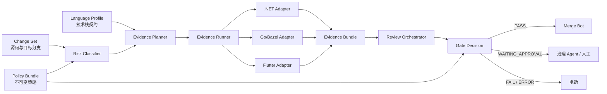

# AgentGate 三项目门禁适配与核心优化设计

> 状态：Draft，待审核，不作为当前实现承诺  
> 版本：v0.1  
> 日期：2026-07-22  
> 目标项目：`netx`、`reborn`、`zhuishu-flutter`  
> 目标仓库：`D:\Code\AgentGate`

## 1. 决策摘要

AgentGate 可以成为 `netx`、`reborn`、`zhuishu-flutter` 的统一治理入口，但当前版本还不能对三个项目形成完整门禁。

原因不是缺少更多正则，而是缺少以下四项基础能力：

1. **语言 profile**：统一描述源码、测试、生成文件、敏感路径和验证命令。
2. **CI 独立证据**：由可信 runner 真正执行 build、test、analyze，禁止仅凭 `Tested:` trailer 放行。
3. **不可变策略**：普通业务 PR 不能修改用于审查自己的策略、脚本和 CI。
4. **统一决策**：扫描器只提供事实，由一个 Gate Decision module 计算最终 PASS、FAIL、ERROR 或 WAITING_APPROVAL。

三项目采用同一治理核心、不同语言 adapter：

| 项目 | 主要技术栈 | profile | 当前有效性 | 目标状态 |
|---|---|---|---:|---|
| netx | .NET 6 / C# / JavaScript / Docker / Helm | `dotnet-monorepo` | 低 | build、test、coverage、安全和部署风险均受控 |
| reborn | Go / Bazel / Docker / Ansible | `go-bazel` | 中低 | lint、Bazel test、build 和敏感域审查均受控 |
| zhuishu-flutter | Dart / Flutter / Android / iOS / 多 flavor | `flutter-mobile` | 低 | analyze、test、coverage、生成代码和多 flavor build 均受控 |

设计原则：**代码可以全部由 AI agent 开发，但同一个开发身份不能同时改代码、改门禁、批准风险并完成合并。**

## 2. 背景与现状

### 2.1 AgentGate 当前能力

当前 AgentGate 已提供：

- 增量风险模式扫描；
- gitleaks 增量密钥扫描；
- MR 描述结构校验；
- 本地测试痕迹记录与 Git 状态绑定；
- `Tested:` 和 `AI-Usage:` trailer；
- Go 受影响包测试；
- 风险注解和过期报告；
- GitHub/GitLab CI 模板与安装器。

当前主要限制：

- 源码扩展名散落在多个脚本中；
- `.dart` 未进入风险扫描、测试检查和证据统计；
- 非 Go 项目没有通用的真实测试执行 module；
- `Tested:` trailer 仍可能成为 CI 的主要放行依据；
- 消费仓库运行 PR 工作树中的门禁脚本和配置；
- GitHub、GitLab、安装器内嵌模板和文档示例存在多份事实源；
- profile、策略、证据和最终决策没有稳定 schema；
- 风险声明、风险批准和最终放行没有分离。

### 2.2 netx 当前状态

- 大型 .NET 微服务仓库，约 1,886 个 C# 文件；
- 根 CI 没有 AgentGate；
- 已有 `ci/test.yml`，包含 restore、build、test 和覆盖率；
- 根 `.gitlab-ci.yml` 注释掉了 `/ci/test.yml`；
- 大量 build/deploy job 为 manual；
- CI 中存在关闭 Git SSL 校验、拼接并 `eval` 部署命令等风险；
- Docker 镜像同时推送唯一 tag 和可变 `latest`。

### 2.3 reborn 当前状态

- Go + Bazel 仓库，约 1,463 个 Go 文件；
- AgentGate v1.2.1 已接入；
- governance risk、metadata、testing 仍为 soft；
- 旧版 GitLab/Runner 限制导致治理主要运行在分支流水线；
- MR 描述校验依赖显式传入变量；
- `test` job 只执行 `go mod vendor`，Bazel test 被注释；
- build 只在 master 执行；
- CI 文件中存在硬编码 webhook 凭证；
- 支付、账户、提现、账务等目录属于高风险业务域。

### 2.4 zhuishu-flutter 当前状态

- 519 个 Dart 文件，其中 `lib/` 下约 467 个；
- 约 39 个 Dart 测试文件，但尚无可信代码覆盖率数据；
- AgentGate v1.2.1 已接入；
- `scan_risks.py` 和 `check_tested.py` 均不识别 `.dart`；
- GitLab CI 没有执行 `flutter analyze`、`flutter test` 或 build；
- 项目包含 fantuan、huohua 多 flavor；
- 存在代码生成、Drift schema、JSON model、assets、Android/iOS 原生集成；
- 仓库跟踪 Android JKS 文件，Gradle 配置存在明文签名凭证。

## 3. 问题定义

### 3.1 当前门禁的三个错误等价

当前实现容易产生以下错误等价：

```text
有 Tested: pass  ≠ CI 真正执行过测试
有测试文件变更  ≠ 变更代码得到覆盖
有 risk 注解    ≠ 风险已经被独立批准
```

### 3.2 三项目不能使用同一个固定测试逻辑

- netx 需要 solution/project 级 .NET 验证；
- reborn 需要 Go 与 Bazel 共同确定测试范围；
- Flutter 需要 Dart analyze、widget/unit test、代码生成和多 flavor 构建；
- iOS build 还依赖 macOS/Xcode runner。

因此 AgentGate 应统一“怎么描述验证、怎么生成证据、怎么做决策”，而不是硬编码“所有仓库运行什么命令”。

### 3.3 控制面与业务面混在同一个 PR

如果开发 agent 能在同一 PR 中修改：

- `governance.config.yml`；
- `governance/scripts/**`；
- `.gitlab-ci.yml`；
- CODEOWNERS/Approval Rule；
- 测试计划；

那么任何业务门禁都有被同一变更削弱的可能。

## 4. 目标与非目标

### 4.1 目标

- 三个仓库使用同一 AgentGate 策略和证据 schema；
- 各技术栈通过独立 adapter 执行真实验证；
- CI 证据绑定源码 SHA、目标分支 SHA 和策略 SHA；
- 普通业务 PR 无法降低本次检查所使用的策略；
- LOW/MEDIUM 变更保持自动化和较快反馈；
- HIGH/CRITICAL 变更自动升级检查与批准要求；
- 失败、基础设施错误、等待批准有不同状态；
- GitHub/GitLab/本地模式语义一致；
- 支持渐进迁移，不一次性阻断三个历史仓库。

### 4.2 非目标

- 不保证 AI 生成代码绝对正确；
- 不以静态正则替代真实测试和业务验收；
- 不要求所有 PR 跑全部测试或所有人工作流；
- 不在本阶段重构三个业务仓库；
- 不自动轮换已泄露的签名密钥和第三方凭证；
- 不在第一阶段完成生产运行时安全监控。

## 5. 需求

### REQ-001 语言 profile

AgentGate 必须通过机器可读 profile 描述语言、路径、测试识别、验证命令和风险升级规则。

### REQ-002 CI 独立执行

合并所需的 build、test、analyze 必须由可信 CI runner 执行，不能采信 agent 自报为最终证据。

### REQ-003 不可变策略

业务 PR 必须使用目标分支或独立发布源中的固定策略，不能使用本 PR 修改后的策略审查自己。

### REQ-004 统一证据

所有 adapter 必须生成同一 Evidence Bundle schema。

### REQ-005 统一决策

所有扫描器和 adapter 只报告结果，由 Gate Decision module 统一返回最终状态。

### REQ-006 风险分级

系统必须区分 LOW、MEDIUM、HIGH、CRITICAL，并只允许升级，不允许后续检查将等级降低。

### REQ-007 权限分离

实现、审查、批准和合并身份必须具有不同权限。

### REQ-008 渐进迁移

每个仓库必须支持 `observe → enforce-selected → enforce-all` 三阶段上线。

### REQ-009 供应链固定

CI 镜像、Action、策略包和扫描工具必须使用不可变 SHA 或 digest。

### REQ-010 可审计

每次决策必须可追溯到 source SHA、policy SHA、profile 版本、证据和批准主体。

## 6. 总体架构



## 7. 核心 module 与 interface

### 7.1 Policy Bundle module

**职责**：加载、验证和提供不可变策略。

**Interface**：

```text
resolve(repository, target_branch) -> PolicyBundle
verify(bundle) -> VerificationResult
```

不变量：

- 返回完整 `policy_sha`；
- 来源必须可验证；
- 不能从 PR 工作树中的可修改脚本获得最终策略；
- 加载失败或签名错误时 fail-closed。

### 7.2 Profile Registry module

**职责**：根据仓库识别或加载语言 profile。

**Interface**：

```text
resolve(repository, policy) -> RepositoryProfile
validate(profile, policy) -> ValidationResult
```

Profile Registry 应取代分散在以下脚本中的扩展名常量：

- `scan_risks.py`
- `check_tested.py`
- `collect_ai_usage.py`
- `report_expired.py`

### 7.3 Risk Classifier module

**职责**：根据 diff、路径、profile 和策略输出风险等级及理由。

**Interface**：

```text
classify(change_set, profile, policy) -> RiskDecision
```

输出：

```yaml
risk_level: low | medium | high | critical
reasons: []
required_checks: []
required_approvals: []
auto_merge_allowed: true | false
```

### 7.4 Evidence Planner module

**职责**：把 change set、risk decision 和 profile 转换为最小充分验证计划。

**Interface**：

```text
plan(change_set, risk_decision, profile, policy) -> EvidencePlan
```

要求：

- 范围计算失败时扩大测试范围，不得静默跳过；
- HIGH/CRITICAL 可以覆盖 profile 的快速路径；
- 测试计划与源码 SHA、profile 版本绑定。

### 7.5 Evidence Runner module

**职责**：调用语言 adapter，生成结构化 Evidence Bundle。

**Interface**：

```text
execute(plan, adapter) -> EvidenceBundle
verify(bundle, source_sha, policy_sha) -> VerificationResult
```

### 7.6 Review Orchestrator module

**职责**：组织标准、需求、安全和高风险域审查。

**Interface**：

```text
review(change_set, requirements, evidence, policy) -> ReviewBundle
```

审查 agent 默认只读，不能修改被审分支或直接合并。

### 7.7 Gate Decision module

**职责**：集中计算最终结果。

**Interface**：

```text
decide(policy, risk, evidence, reviews, approvals) -> GateResult
```

结果优先级：

```text
ERROR > FAIL > WAITING_APPROVAL > PASS
```

只有 Gate Decision module 可以产生最终 PASS。

## 8. Schema 设计

### 8.1 Repository Profile

```yaml
schema_version: v1
profile_id: flutter-mobile/v1

languages:
  - id: dart
    source_extensions: [".dart"]
    test_patterns: ["test/**/*_test.dart", "integration_test/**/*_test.dart"]
    generated_patterns: ["**/*.g.dart", "**/*.freezed.dart"]

commands:
  analyze:
    run: flutter analyze --fatal-infos
    timeout_seconds: 600
  unit_test:
    run: flutter test --coverage
    timeout_seconds: 1200

risk_paths:
  high: []
  critical: []

required_checks:
  low: []
  medium: [analyze, unit_test]
  high: [analyze, unit_test, build]
```

### 8.2 Evidence Bundle

```yaml
schema_version: v1
evidence_id: <uuid>
source_sha: <full sha>
target_sha: <full sha>
policy_sha: <full sha>
profile_id: <profile/version>
runner_identity: <trusted runner>
checks:
  - check_id: unit_test
    command_digest: <sha256>
    started_at: <utc>
    finished_at: <utc>
    exit_code: 0
    status: pass | fail | error | skipped
    summary: {}
    artifact_digests: []
```

规则：

- `skipped` 只有策略显式允许时才算满足；
- `exit_code != 0` 不能由报告转换成 PASS；
- SHA 或 policy 不匹配时整份证据无效；
- 本地证据和 trailer 不能标记为 trusted runner。

### 8.3 Gate Result

```yaml
schema_version: v1
source_sha: <sha>
policy_sha: <sha>
risk_level: high
result: pass | fail | error | waiting_approval
required_checks: []
missing_checks: []
blocking_findings: []
valid_approvals: []
decision_digest: <sha256>
```

## 9. 语言 profile 与 adapter

### 9.1 dotnet-monorepo profile

适用于 `netx`。

源码：

```yaml
source_extensions: [".cs", ".cshtml", ".js", ".ts"]
test_patterns:
  - "**/*.Test/**"
  - "**/*.Tests/**"
  - "**/*Tests.cs"
```

快速路径：

```text
dotnet restore <affected solution/project>
dotnet build <affected solution/project> --no-restore
dotnet test <affected test project> --no-build --collect:"XPlat Code Coverage"
```

严格路径：

```text
dotnet restore X.sln
dotnet build X.sln --no-restore
dotnet test X.sln --no-build --collect:"XPlat Code Coverage"
```

特殊规则：

- 修改共享 `X.Core`、公共 contracts、NuGet 配置时扩大测试范围；
- 修改 Dockerfile、charts、ci、deploy 脚本至少 HIGH；
- 出现 `eval`、关闭 TLS/SSL 校验、可变镜像 tag 时阻断或要求批准；
- coverage 报告必须来自测试进程，并提供 diff coverage；
- solution/project 依赖图无法计算时运行全量路径。

### 9.2 go-bazel profile

适用于 `reborn`。

源码：

```yaml
source_extensions: [".go", ".bzl", ".proto"]
test_patterns:
  - "**/*_test.go"
  - "**/BUILD.bazel"
```

快速路径：

```text
bash build/lint.sh
bazel test --test_output=errors <affected targets>
```

严格路径：

```text
bash build/lint.sh
bazel test --test_output=errors //src/... //library/...
bash build/bazel-build.sh
```

特殊规则：

- 禁止 test job 只有 `go mod vendor`；
- Bazel query/依赖分析失败时运行严格路径；
- 支付、账户、提现、账务目录至少 HIGH；
- 修改 BUILD、WORKSPACE、go.mod、go.sum、vendor 至少 HIGH；
- webhook、部署、Ansible、SSH 配置至少 HIGH；
- `StrictHostKeyChecking=no`、硬编码 webhook/token、跳过测试属于阻断 finding；
- AgentGate 的 Go 反向依赖一跳只能作为提示，不替代 Bazel target 图。

### 9.3 flutter-mobile profile

适用于 `zhuishu-flutter`。

源码：

```yaml
source_extensions: [".dart", ".kt", ".java", ".swift", ".m", ".mm"]
test_patterns:
  - "test/**/*_test.dart"
  - "integration_test/**/*_test.dart"
generated_patterns:
  - "**/*.g.dart"
  - "**/*.freezed.dart"
```

快速路径：

```text
flutter pub get
flutter analyze --fatal-infos
flutter test --coverage
```

Android 构建路径：

```text
dart run tool/gen_brands.dart
./scripts/build.sh fantuan apk debug
```

涉及 `brands/**`、flavor、Android Gradle 或品牌生成器时：

```text
./scripts/build.sh fantuan apk debug
./scripts/build.sh huohua apk debug
```

iOS 严格路径在 macOS runner 执行：

```text
./scripts/build.sh fantuan ios debug
```

特殊规则：

- `analysis_options.yaml`、pubspec、lockfile、Gradle、Podfile 至少 HIGH；
- JKS、keystore、签名配置、支付 SDK、登录、隐私、WebView 至少 CRITICAL/HIGH；
- 修改 Drift schema 或 JSON model 时必须执行代码生成一致性检查；
- 生成后工作树存在未提交差异时 FAIL；
- `testWidgets(...)` 删除必须识别为 test-removal；
- `skip:`、`ignore_for_file`、降低 lint 规则必须识别为测试/质量弱化；
- `dart pub outdated` 只作信息报告，漏洞门禁读取 `pubspec.lock`；
- native plugin 风险不能只靠 Dart unit test，关键 platform channel 需要 integration/native test。

## 10. 三项目 CI 设计

### 10.1 统一 pipeline

```text
policy-verify
  → classify
  → validate-profile
  → lint/analyze + secret + static-risk（并行）
  → affected-test
  → build
  → security/dependency
  → review
  → gate-decision
  → merge
```

### 10.2 netx pipeline

建议阶段：

```yaml
stages:
  - governance
  - validate
  - test
  - build
  - package
  - deploy-development
  - deploy-production
```

第一阶段：

- 恢复 `/ci/test.yml`；
- 增加 governance include；
- MR 执行 restore/build/test；
- build/deploy 继续手动；
- 禁止自动关闭 SSL 校验；
- 对部署脚本和镜像 tag 增加策略检查。

后续阶段：

- 依据 solution/project 引用关系选择受影响测试；
- 共享库变化自动扩大范围；
- Cobertura 作为 artifact；
- 引入 diff coverage；
- 部署只消费当前 source SHA 产生的不可变镜像 digest。

### 10.3 reborn pipeline

第一阶段：

- 保留旧 GitLab 兼容方式；
- 恢复 `bash build/bazel-test.sh`；
- test job 没有执行测试时直接失败；
- branch pipeline 输出结构化 Evidence Bundle；
- MR 描述变量缺失时标记 ERROR，而不是静默跳过；
- master 合并后重复执行关键治理与测试。

GitLab 升级后：

- 改用 MR pipeline；
- 明确 target branch SHA；
- 避免 branch/MR 重复 pipeline；
- build 在 MR 阶段执行；
- 合并只接受受保护 runner 的 GateResult。

### 10.4 zhuishu-flutter pipeline

第一阶段 Linux runner：

```yaml
flutter:analyze:
  stage: validate
  script:
    - flutter pub get
    - flutter analyze --fatal-infos

flutter:test:
  stage: test
  script:
    - flutter test --coverage
  artifacts:
    when: always
    paths:
      - coverage/lcov.info

flutter:build-fantuan:
  stage: build
  script:
    - ./scripts/build.sh fantuan apk debug
```

按路径触发：

- `brands/**` 或生成器变化：增加 huohua build；
- `android/**` 或 native plugin 变化：至少执行双 flavor build；
- `ios/**` 或跨平台 plugin 变化：触发 macOS runner；
- 只有文档变化：跳过 Flutter build，但保留 policy/secret 检查。

## 11. 风险分级

| 等级 | 典型变化 | 最低检查 | 批准 |
|---|---|---|---|
| LOW | 文档、非执行资源 | policy、secret、结构校验 | 自动 |
| MEDIUM | 普通业务逻辑 | lint/analyze、受影响测试 | 自动或治理 agent |
| HIGH | 公共接口、依赖、数据库、构建、部署 | 扩大测试、build、安全检查 | 独立治理 agent |
| CRITICAL | 门禁、权限、签名、支付、生产密钥、数据删除 | 全量验证、不可变策略检查 | 人工 |

自动升级条件：

- 修改治理脚本、CI、CODEOWNERS、测试计划；
- 修改认证、授权、支付、签名、隐私；
- 修改数据库 schema 或不可逆迁移；
- 删除/跳过测试、降低 lint/coverage；
- 受影响范围计算失败；
- 修改部署权限或生产凭证；
- 策略、runner 或证据来源无法验证。

## 12. 不可变策略与供应链

### 12.1 控制面

控制面保存：

- Policy Bundle；
- Profile Registry；
- 风险分类规则；
- schema；
- CI adapter 生成器；
- 受保护路径和最低批准要求。

业务仓库只保存：

- 固定策略引用；
- 仓库 profile 选择；
- 在策略允许范围内的参数；
- 需求、风险和测试映射。

### 12.2 发布约束

- GitHub Action 固定完整 SHA；
- GitLab include 固定 tag/SHA，不引用 `main`；
- 容器固定 digest，不使用 `latest`；
- Python 依赖使用锁文件和哈希；
- 安装器校验下载文件 SHA-256；
- 发布产物包含 SBOM、checksum 和签名；
- CI 输出记录 policy SHA。

### 12.3 治理自保护

以下文件由平台 Ruleset/Approval Rule 外部保护：

```text
.github/workflows/**
.gitlab-ci.yml
.gitlab/**
ci/**
governance/**
governance.config.yml
CODEOWNERS
AGENTS.md
CLAUDE.md
language-profiles/**
policy/**
dependency lock files
deployment/**
charts/**
```

普通 PR 修改这些文件时，必须使用目标分支策略审查，并至少升级 HIGH。

## 13. CI 独立证据与 anti-gaming

### 13.1 证据来源

| 来源 | 可用于最终放行 | 说明 |
|---|---|---|
| 可信 CI runner Evidence Bundle | 是 | 最终事实来源 |
| 平台 Required Check | 是 | 分支保护来源 |
| 独立 Review/Approval Bundle | 按风险 | 审查与批准 |
| 本地 test evidence | 否 | 开发反馈 |
| `Tested:` trailer | 否 | 人类可读摘要 |
| MR 自测说明 | 否 | 上下文 |

### 13.2 anti-gaming

必须检测：

- 空测试、恒真断言、无断言测试；
- 新增 skip/only/focus/exclude；
- 删除测试；
- 降低 coverage/lint 阈值；
- test job 只安装依赖但没有执行测试；
- 将失败命令包装成始终返回 0；
- `|| true` 吞掉 analyze/test/build 失败；
- 生成零用例报告；
- Evidence Bundle 的 SHA 不匹配；
- 同一 PR 修改测试计划并依赖新计划放行自己。

## 14. 职责与权限分离

| 角色 | 允许 | 禁止 |
|---|---|---|
| Developer Agent | 功能分支代码与测试 | 主干、规则管理、自我批准、部署 |
| Test Agent | 只读需求/diff、生成或运行独立测试 | 修改生产代码、批准、合并 |
| Review Agent | 只读审查、结构化 finding | 修改被审分支、合并 |
| Governance Agent | 审核 MEDIUM/HIGH、风险豁免 | 实现同一 PR、平台管理员操作 |
| Merge Bot | GateResult=PASS 时合并 | 修改代码、管理员绕过 |
| Human Owner | CRITICAL、密钥、签名、治理变更 | 普通 LOW/MEDIUM 无需参与 |

最低身份要求：

- 不同凭证；
- 独立上下文；
- 最小权限；
- 批准绑定 source SHA 和 policy SHA；
- 实现者不能成为最终批准者；
- 长期管理员 token 不进入普通 job。

## 15. 已发现敏感信息处理

### 15.1 reborn

- 将硬编码 webhook 迁移到 masked/protected CI variable；
- 立即轮换现有 token；
- 扫描 Git 历史和流水线日志；
- 不在文档、issue 或 MR 中复制原始值。

### 15.2 zhuishu-flutter

- 确认被跟踪 JKS 是否为生产签名；
- 将签名文件迁移到 protected file variable 或专用制品库；
- 将口令迁移到 masked/protected variable；
- 评估 Android 应用签名连续性后决定轮换；
- 扫描历史和已分发构建环境；
- 未完成评估前不做破坏性删除。

### 15.3 netx

- 禁止关闭 SSL 校验；
- 审计 Git push、registry 和部署 token 权限；
- Docker login 使用 stdin 或 runner 原生 credential；
- 检查历史配置、connection string、证书和 Helm secret。

## 16. 故障与降级

| 故障 | 行为 |
|---|---|
| 策略签名/摘要失败 | ERROR，禁止合并 |
| runner 身份无法验证 | ERROR |
| profile 不存在或非法 | ERROR |
| 受影响范围计算失败 | 扩大测试范围并升级 HIGH |
| 测试失败 | FAIL |
| 测试零用例 | FAIL |
| CI 网络/runner 故障 | ERROR，可对同一 SHA 重试 |
| 审查超时 | LOW/MEDIUM 可重试，HIGH/CRITICAL 等待 |
| 证据 SHA 不匹配 | FAIL，重新执行 |
| 高风险批准缺失 | WAITING_APPROVAL |
| adapter 主动降级 | 只有策略显式允许，否则 ERROR |

禁止把 ERROR 当作 PASS，也禁止因平台故障自动切换到更弱的检查。

## 17. 性能预算

以下是设计目标，不是当前实测值：

| 项目/路径 | P50 | P95 | 说明 |
|---|---:|---:|---|
| 通用 LOW | 3 分钟 | 5 分钟 | policy、secret、结构检查 |
| netx MEDIUM | 10 分钟 | 20 分钟 | 受影响 project build/test |
| reborn MEDIUM | 8 分钟 | 15 分钟 | lint + affected Bazel targets |
| Flutter MEDIUM | 8 分钟 | 15 分钟 | analyze + test |
| HIGH | 20 分钟 | 45 分钟 | 扩大测试、安全和构建 |

优化方式：

- 检查并行；
- 缓存键包含 lockfile、source SHA 和 profile 版本；
- LOW/MEDIUM 走受影响范围；
- 主干/夜间执行全量；
- build artifact 在后续阶段复用；
- 只重试基础设施错误，不自动重试业务失败成绿。

## 18. 迁移计划

### Phase 0：安全事件与基线

- 处理 reborn webhook；
- 评估 Flutter JKS 和签名凭证；
- 恢复 AgentGate 自身完整自测；
- 记录三个项目 CI 时长、失败和 flaky 基线；
- 不改变业务合并行为。

退出条件：已知秘密有明确处置结论，AgentGate 自测稳定通过。

### Phase 1：核心 schema 与 profile

- 实现 Policy Bundle、Repository Profile、Evidence Bundle、Gate Result schema；
- 中央化源码扩展名；
- 实现 `dotnet-monorepo`、`go-bazel`、`flutter-mobile` profile；
- 为三 profile 编写 fixture 和回归测试；
- observe 模式输出计划和风险等级。

退出条件：同一 diff 在本地/GitLab adapter 得到一致分类和计划。

### Phase 2：真实 CI 证据

- netx 恢复 restore/build/test；
- reborn 恢复 Bazel test；
- Flutter 增加 analyze/test/fantuan debug build；
- Evidence Runner 生成并校验证据；
- `Tested:` 降为展示字段。

退出条件：手写 trailer、添加无关测试、零用例测试均不能放行。

### Phase 3：不可变策略和权限分离

- 策略发布固定 SHA/digest；
- 外部保护治理文件；
- Developer、Review、Governance、Merge Bot 身份分离；
- LOW/MEDIUM 自动化，HIGH/CRITICAL 升级。

退出条件：单一开发身份无法完成从修改代码到合并的完整闭环。

### Phase 4：质量和安全扩展

- diff coverage；
- NuGet/Go/Dart 依赖漏洞扫描；
- SAST、IaC、容器、许可证；
- Flutter integration/native tests；
- anti-gaming；
- 运营指标和误报治理。

## 19. 验收标准

### AC-001 netx 未执行测试不得通过

**Given** netx PR 修改 C# 生产代码  
**When** `dotnet test` 未执行、零用例或退出非零  
**Then** GateResult 为 FAIL/ERROR，`Tested: pass` 不能改变结果。

### AC-002 netx 共享库扩大测试

**Given** PR 修改共享库或公共 contract  
**When** Evidence Planner 计算范围  
**Then** 选择全部受影响 solution/project；无法计算时运行全量。

### AC-003 reborn 必须执行 Bazel 测试

**Given** reborn PR 修改 Go 生产代码  
**When** CI test job 只运行 `go mod vendor` 或 Bazel test 未执行  
**Then** GateResult 为 FAIL。

### AC-004 reborn 高风险域升级

**Given** PR 修改 payment、account、withdraw、billing 等敏感目录  
**When** Risk Classifier 分类  
**Then** 风险不低于 HIGH，并要求严格测试与独立批准。

### AC-005 Flutter Dart 文件进入门禁

**Given** PR 修改任意 `.dart` 生产文件  
**When** risk、test、AI usage 和过期报告处理 diff  
**Then** 四者均识别该文件，不能因扩展名跳过。

### AC-006 Flutter 真实验证

**Given** PR 修改 Dart 业务代码  
**When** CI 执行  
**Then** 至少完成 `flutter analyze` 和 `flutter test`，证据绑定当前 SHA。

### AC-007 Flutter flavor 变化触发双构建

**Given** PR 修改 `brands/**`、品牌生成器或 Android flavor 配置  
**When** Evidence Planner 生成计划  
**Then** fantuan 和 huohua debug build 均为必需检查。

### AC-008 生成代码必须同步

**Given** PR 修改 Drift schema、JSON model 或品牌配置  
**When** CI 执行生成器  
**Then** 工作树出现未提交生成差异时 FAIL。

### AC-009 策略不可自我削弱

**Given** 普通 PR 同时修改业务代码和治理配置/脚本  
**When** CI 执行  
**Then** 使用目标分支固定 Policy Bundle，风险升级 CRITICAL，不能自动合并。

### AC-010 trailer 不再是最终证据

**Given** PR 手写 `Tested: pass`  
**When** 缺少匹配当前 SHA 的可信 Evidence Bundle  
**Then** GateResult 不能为 PASS。

### AC-011 测试范围失败时安全扩大

**Given** project、Bazel 或 Flutter 依赖范围计算失败  
**When** Evidence Planner 处理  
**Then** 扩大测试或升级 HIGH，不允许返回“无需测试”。

### AC-012 实现者不能批准自己

**Given** Developer Agent 是提交者  
**When** 同一身份提交风险批准  
**Then** 批准无效。

### AC-013 秘密扫描同时覆盖增量与基线

**Given** 新增秘密或仓库基线存在已知未处置秘密  
**When** CI/定时扫描执行  
**Then** 新增秘密硬阻断；基线秘密进入有 owner、期限和状态的整改清单。

### AC-014 平台语义一致

**Given** 相同 change set、profile 和 Policy Bundle  
**When** 本地与 GitLab adapter 执行  
**Then** 风险等级、必需检查和决策输入一致。

### AC-015 ERROR 不得自动放行

**Given** 策略、runner、网络、范围计算或证据验证发生错误  
**When** Gate Decision 执行  
**Then** 结果为 ERROR 或扩大验证，不得返回 PASS。

## 20. 测试策略

### 20.1 AgentGate module 测试

- Profile Registry schema 和合并规则；
- Risk Classifier 路径升级；
- Evidence Planner 最小/严格计划；
- Evidence Bundle SHA/digest 验证；
- Gate Decision 状态优先级；
- approval 身份与自批检查；
- GitLab/GitHub adapter golden tests。

### 20.2 profile fixture

为每个 profile 建最小 fixture：

```text
tests/fixtures/dotnet-monorepo/
tests/fixtures/go-bazel/
tests/fixtures/flutter-mobile/
```

每个 fixture 覆盖：

- 普通源码变更；
- 测试变更；
- 删除测试；
- 生成代码；
- 敏感路径；
- 策略修改；
- 范围计算失败；
- 零用例和失败命令；
- 旧证据重用；
- 跨平台路径格式。

### 20.3 端到端验收

- 在三个真实仓库的临时分支以 observe 模式执行；
- 比较当前 CI 与新计划；
- 收集至少一周数据；
- 先硬化确定性高的检查；
- 每个仓库单独决定 enforce 时间，不使用统一日期强切。

## 21. 预计代码结构

```text
AgentGate/
  policy/
    schema.yml
    default-policy.yml
    release-manifest.json

  language-profiles/
    dotnet-monorepo.yml
    go-bazel.yml
    flutter-mobile.yml

  schemas/
    repository-profile.schema.json
    evidence-plan.schema.json
    evidence-bundle.schema.json
    review-bundle.schema.json
    gate-result.schema.json

  scripts/
    policy_bundle.py
    profile_registry.py
    risk_classifier.py
    evidence_planner.py
    evidence_runner.py
    review_orchestrator.py
    gate_decision.py
    generate_ci_adapters.py

  adapters/
    dotnet/
    go_bazel/
    flutter/
    gitlab/
    github/
    local/

  tests/
    unit/
    acceptance/
    golden/
    fixtures/
```

旧脚本第一阶段保留，逐步成为深 module 内部实现，而不是继续由每个 CI job 单独决定 soft/hard 和退出语义。

## 22. 兼容策略

- 保留现有 risk 注解格式，但声明不等于批准；
- 保留 `Tested:` 和 `AI-Usage:` trailer，但不作为可信证据；
- 旧 `governance.config.yml` 转换成 repository profile 参数；
- 未识别字段在 observe 模式告警，在 enforce 模式报错；
- 老 GitLab 使用 branch adapter，新 GitLab 使用 MR adapter；
- 旧 CI 模板在生成器稳定后进入弃用期；
- 每个消费仓库固定 AgentGate 版本，不自动跟随 main。

## 23. 运营指标

每周统计：

- 风险等级分布；
- P50/P95 反馈时间；
- 自动合并比例；
- 人工介入比例；
- 失败、ERROR、flaky 分布；
- 零用例和测试弱化次数；
- 误报和豁免数量；
- 策略/profile 版本覆盖率；
- 合并后回滚和漏检；
- 三项目每种检查的边际耗时。

建议目标：

- LOW/MEDIUM 至少 80% 不需要人工；
- flaky 检查率低于 2%；
- 所有合并可追溯 source SHA 和 policy SHA；
- CRITICAL 变更 100% 有独立批准；
- 测试零用例、证据缺失和 CI ERROR 的自动放行率为 0。

## 24. 审核决策点

请重点确认：

1. 治理文件、生产签名和密钥变化是否统一定义为 CRITICAL？
2. reborn 因旧 GitLab 限制，第一阶段是否接受 branch pipeline + master 重验？
3. netx 第一阶段是否恢复全量 `X.sln` 测试，之后再做受影响 project 优化？
4. Flutter 普通 PR 是否必须执行 fantuan debug build，还是只有 native/flavor 变化才执行？
5. HIGH 是否允许两个独立治理 agent 批准，CRITICAL 是否必须人工？
6. 是否接受 `Tested:` trailer 完全退出最终放行依据？
7. 三项目的 enforce 顺序是否采用 `reborn → Flutter → netx`？
8. 是否允许 AgentGate v2 引入不兼容配置 schema，还是必须兼容 v1.2.1？

## 25. 推荐实施顺序

1. 处置已发现的 webhook 和签名秘密；
2. 修复 AgentGate 自测并建立发布基线；
3. 实现 Profile Registry 和三个语言 profile；
4. 实现 Evidence Bundle、Planner 和 Gate Decision；
5. 在 reborn 恢复 Bazel 测试并试点 Evidence Runner；
6. 在 Flutter 增加 `.dart` 支持、analyze、test 和 fantuan build；
7. 在 netx 接入 AgentGate 并恢复现有 test job；
8. 固定策略/镜像/依赖版本；
9. 拆分 agent 身份和 Merge Bot；
10. 扩展依赖、安全、coverage 和 anti-gaming 检查。

每一步单独验收，不在一个大 PR 中同时重写 AgentGate 和三个消费仓库。
