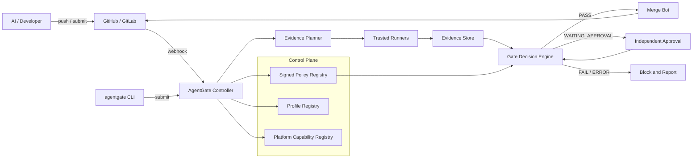
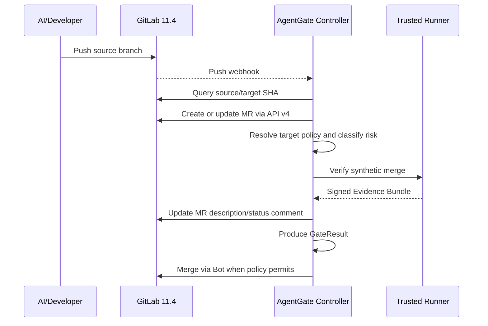
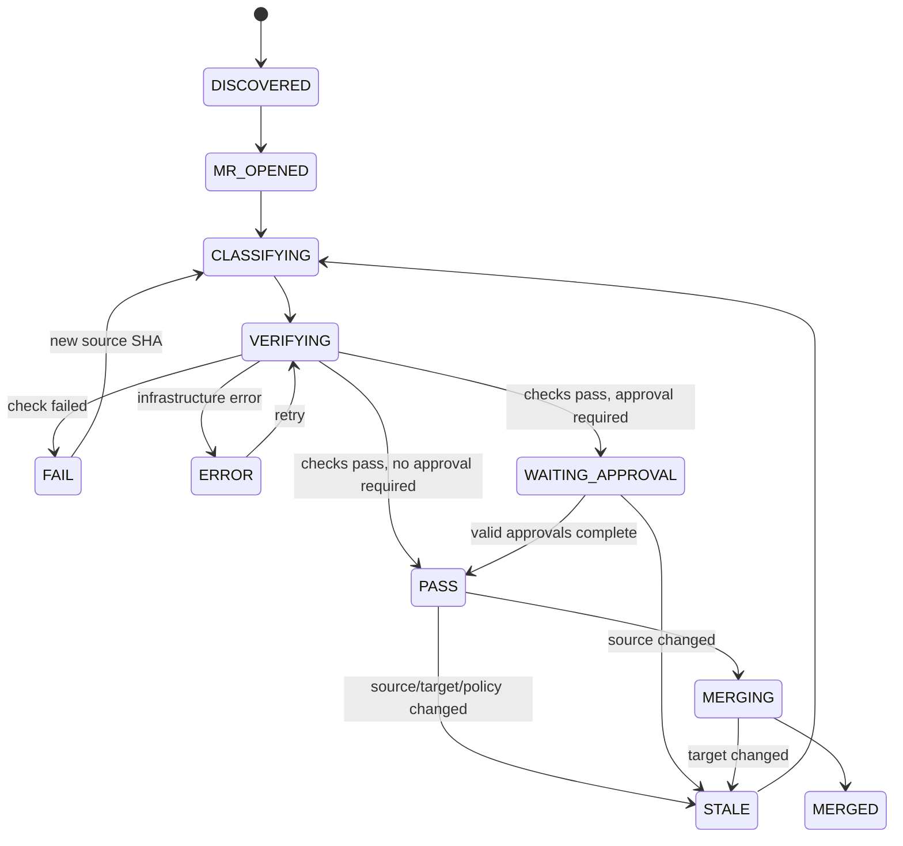

# AgentGate 跨平台自动 MR 与风险自动合并设计

> 状态：Draft，待评审，不代表现有功能已经完成  
> 版本：v0.1  
> 日期：2026-07-24  
> 适用平台：现代 GitHub、GitLab Community Edition 11.4.0  
> 核心目标：在不牺牲风险控制的前提下，实现自动创建 MR/PR、条件自动合并，并将整体代码质量管控能力稳定提升到 6 分以上

## 1. 决策摘要

AgentGate 不应继续被设计成“复制到每个项目里的一组 CI 脚本”，而应升级为一个独立、可信、可审计的跨平台治理系统。

推荐方案由四层组成：

1. **控制面**：集中管理版本化策略、语言 profile、风险规则和平台能力。
2. **执行面**：在可信 runner 上真正执行 format、lint、analyze、test、build 和 security checks。
3. **决策面**：根据不可变策略和真实证据，输出唯一的 `PASS`、`FAIL`、`ERROR` 或 `WAITING_APPROVAL`。
4. **强制面**：GitHub 使用 Rulesets 和 required checks；GitLab 11.4 使用保护分支、外部 Controller、Bot 合并身份，并可选增加服务端 `pre-receive` hook。

GitLab CE 11.4.0 没有现代 Merge Request Pipeline、`rules`、merge train、现代审批规则和策略执行能力，因此不能照搬 GitHub 或新版 GitLab 的方案。旧版 GitLab 的最终门禁必须由 **AgentGate Controller 在仓库 CI 之外完成**。

自动化边界如下：

| 风险等级 | 自动创建 MR/PR | 自动验证 | 审批要求 | 自动合并 |
|---|---:|---:|---:|---:|
| LOW | 是 | 是 | 0 | 是 |
| MEDIUM | 是 | 是 | 0 | 是 |
| HIGH | 是 | 是 | 1 名独立批准人 | 批准后自动合并 |
| CRITICAL | 是 | 是 | 2 名独立批准人 | 默认否，人工最终确认 |

关键原则：

- AI 可以自动写代码、推送分支和提交 MR，但不能自证代码正确。
- MR 描述、commit trailer、AI 自述和“修改了测试文件”都不是最终放行证据。
- 普通变更只能加强门禁，不能修改正在审查自己的最终策略。
- 风险等级只能提高，不能由提交者或后续步骤降低。
- 合并前必须重新确认 source SHA、target SHA、merge SHA 和 policy digest。
- 失败与基础设施错误都不得自动合并，系统默认 fail-closed。

按本文设计完整落地后，AgentGate 的代码质量管控目标评分为 **7.5/10**；如果没有 GitLab API、保护分支和可信 runner，只能达到约 **3/10**，自动 MR 和可信自动合并也无法成立。

## 2. 背景与现实约束

### 2.1 平台现状

- GitHub 使用现代版本，可以采用 GitHub App、Checks、Rulesets、可复用 workflow、原生 auto-merge 和 merge queue。
- GitLab 固定为 Community Edition 11.4.0，必须兼容其旧 CI 语法和功能边界。
- AgentGate 是通用门禁，不能把 Flutter、Go、.NET 或某个业务目录硬编码进核心决策逻辑。
- 团队希望 AI 提交的代码自动满足 MR 规范，并尽可能缩短从代码完成到合并的时间。

### 2.2 GitLab 11.4 的关键限制

GitLab 11.4 方案不能依赖以下现代能力：

- Merge Request Pipelines；
- `only: merge_requests` 和 MR pipeline 变量；
- `rules`；
- `needs` DAG；
- merged result pipelines；
- merge trains；
- Pipeline Execution Policies；
- 现代 approval rules；
- project access token。

仓库内 `.gitlab-ci.yml` 应只使用保守兼容能力，例如：

```yaml
stages:
  - validate
  - test
  - build

agentgate_fast_feedback:
  stage: validate
  script:
    - ./agentgate-ci fast-check
  only:
    - branches
```

该 branch pipeline 只负责快速反馈，**不能被视为最终合并判定**，原因包括：

- 它验证的是 source branch 工作树，不一定是 source 与最新 target 的合并结果；
- 提交者可能同时修改 `.gitlab-ci.yml` 或仓库内门禁脚本；
- 旧版 GitLab 无法用现代 MR pipeline 对合并结果建立原生强约束。

### 2.3 GitLab API 是硬前提

自动创建 MR 和自动合并依赖 GitLab API v4。部署前必须确认 AgentGate Controller 能访问：

```text
/api/v4/projects/:id/merge_requests
```

如果当前 nginx、反向代理或 GitLab 配置对 `/api/v4` 返回 `403`，必须先修复网络和权限；AgentGate 不能通过浏览器自动化或模拟点击替代稳定 API。

GitLab 侧应建立专用 Bot 用户，并授予完成以下动作所需的最小权限：

- 读取项目、分支、提交、pipeline 和 MR；
- 创建或更新 MR；
- 合并通过门禁的 MR；
- 删除已合并 source branch。

Bot 使用 Personal Access Token，token 保存在 Controller 的 secret store 中，不进入代码仓库，也不作为 source branch pipeline 可读取的变量。

## 3. 目标与非目标

### 3.1 目标

- 在 GitHub 和 GitLab 11.4 上提供一致的风险、证据和最终决策语义。
- 自动创建或更新 MR/PR，并自动生成满足规范的描述。
- LOW、MEDIUM 风险在全部证据通过后自动合并。
- HIGH 风险在独立审批后自动合并。
- CRITICAL 风险默认保留人工最终合并。
- 真实运行格式检查、静态分析、测试、构建和安全检查。
- 最终证据绑定本次合并对应的源码、目标分支和策略版本。
- 门禁规则与业务仓库解耦，通过 profile 和 policy pack 支持不同技术栈。
- 在风险可控前提下减少等待、重复执行和人工点击。
- 支持旧项目渐进迁移，避免一次性阻断所有历史问题。

### 3.2 非目标

- 不承诺 AI 生成代码天然正确或天然遵守规范。
- 不用 MR 模板文本替代真实质量验证。
- 不要求每次低风险改动运行整个单体仓库的所有构建。
- 不在 AgentGate 核心中硬编码某个项目的目录、flavor 或测试命令。
- 不依赖 GitLab 11.4 不具备的现代功能。
- 不允许为了追求合并速度而把 `ERROR` 当作 `PASS`。
- 不在第一阶段自动处理生产发布、数据库上线和密钥轮换。

## 4. 质量管控评分模型

采用 10 分制评估 AgentGate 是否真正控制代码质量，而不是只检查流程文本。

| 维度 | 权重 | 达标定义 |
|---|---:|---|
| 真实验证 | 2.0 | CI 真正执行 analyze/test/build/security，不采信自报结果 |
| 策略防篡改 | 1.5 | 使用目标分支或中央签名策略，业务变更不能降低门禁 |
| 合并结果验证 | 1.5 | 验证 source 与最新 target 的合并结果，并绑定 SHA |
| 风险分级 | 1.0 | LOW/MEDIUM/HIGH/CRITICAL 对应差异化检查和审批 |
| 强制执行 | 1.5 | 保护分支和机器人合并形成不可绕过的正常路径 |
| 证据审计 | 1.0 | 证据可追溯、结构化、可校验、可保留 |
| 通用适配 | 0.5 | 核心不依赖具体语言和项目 |
| 反馈效率 | 0.5 | 并行、缓存、受影响范围和自动合并减少等待 |
| **总计** | **10.0** | 目标不低于 6.0 |

预计成熟度：

| 阶段 | 预计评分 | 说明 |
|---|---:|---|
| 仅 MR 模板和文本扫描 | 2.0–3.0 | 可以规范描述，但不能证明代码质量 |
| 真实 CI，但策略可被同一 MR 修改 | 4.0–5.0 | 有证据，但存在明显自我放行风险 |
| 外部 Controller + 不可变策略 + 保护分支 | 6.5–7.5 | 达到可用的工程门禁水平 |
| 加服务端 hook、签名证据和完整可观测性 | 8.0+ | 对绕过、篡改和运维故障有更强控制 |

本文目标不是用更多表单把评分“填到 6 分”，而是通过可信执行和强制合并路径实际达到 6 分以上。

## 5. 总体架构



### 5.1 控制面

职责：

- 发布和解析版本化 policy bundle；
- 管理语言/框架 profile；
- 管理风险规则包；
- 检测 GitHub、GitLab 版本和能力；
- 决定不同平台采用哪种 enforcement adapter；
- 验证仓库 override 只能收紧，不能放宽中央基线。

控制面策略必须满足：

- 使用不可变版本和内容 digest；
- 生产策略变更经过独立审查；
- 保留发布记录和回滚版本；
- Controller 无法加载或校验策略时 fail-closed。

### 5.2 执行面

职责：

- 按 Evidence Plan 拉取指定 source SHA 和 target SHA；
- 创建临时 synthetic merge；
- 在隔离、可信环境执行命令；
- 生成 JUnit、coverage、SARIF、build manifest 等标准证据；
- 上传证据并返回不可变引用。

可信 runner 不应直接执行 source branch 提供的任意治理脚本。允许执行项目构建脚本时，应通过隔离、最小凭证、超时和资源限制降低供应链风险。

### 5.3 决策面

职责：

- 合并所有 scanner 和 runner 的事实结果；
- 计算最终风险等级；
- 校验证据与 SHA、策略和执行身份的绑定；
- 计算审批要求；
- 输出唯一 GateResult；
- 对重复输入给出确定性结果。

最终状态：

| 状态 | 含义 | 是否可合并 |
|---|---|---:|
| `PASS` | 所有要求满足 | 按风险策略决定 |
| `FAIL` | 代码或策略要求未满足 | 否 |
| `ERROR` | runner、网络、解析或证据系统异常 | 否 |
| `WAITING_APPROVAL` | 技术检查通过，尚缺独立批准 | 否 |

### 5.4 强制面

GitHub：

- GitHub App 负责创建 PR、发布 Checks 和执行合并；
- Rulesets/branch protection 要求 AgentGate check 成功；
- 条件允许时使用原生 auto-merge 或 merge queue；
- workflow 与第三方 Action 固定到 commit SHA。

GitLab 11.4：

- 保护目标分支，禁止普通开发者直接 push；
- Bot 是正常流程下唯一合并身份；
- Maintainer 仅保留受审计的紧急绕过权限；
- Controller 通过 API 创建、更新和合并 MR；
- 最终 GateResult 不依赖仓库 branch pipeline 的自报状态；
- 高安全场景在 GitLab 服务端安装 `pre-receive` hook，验证 AgentGate decision ID。

## 6. 信任边界与身份分离

### 6.1 不可信输入

以下内容均视为不可信输入：

- source branch 中的代码；
- source branch 中的 `.gitlab-ci.yml`、GitHub workflow 和治理配置；
- MR/PR 标题与描述；
- commit message、`Tested:` 和 `AI-Usage:` trailer；
- AI agent 输出的测试结论；
- source branch 产生但未由可信系统签名的报告。

### 6.2 可信组件

- AgentGate Controller；
- 中央 policy/profile registry；
- 可信 runner 镜像和启动配置；
- Evidence Store；
- Gate Decision Engine；
- GitHub App 或 GitLab Bot 的受保护凭证；
- 可选 GitLab 服务端 hook。

### 6.3 最小身份模型

| 身份 | 权限 | 禁止事项 |
|---|---|---|
| Developer/AI | 创建分支、push、请求验证 | 不能直推保护分支、不能签发最终 PASS |
| AgentGate Runner | 只读代码、写证据 | 不能审批、不能直接合并 |
| Approver | 批准指定风险 MR | 不能批准自己的变更 |
| Merge Bot | 读取决策、执行合并 | 不能修改策略、不能伪造证据 |
| Policy Admin | 发布中央策略 | 不参与同一变更的代码提交和批准 |
| Emergency Admin | 紧急绕过 | 每次绕过必须留痕和复盘 |

## 7. 通用策略与 Profile

### 7.1 仓库只声明使用哪个 Profile

业务仓库保留一个最小声明文件，例如 `.agentgate/repository.yml`：

```yaml
api_version: agentgate.io/v2
kind: RepositoryPolicy

profile:
  name: flutter-mobile
  version: 2.0.0
  digest: sha256:PROFILE_DIGEST

target_branches:
  - master
  - develop

testing:
  minimum_line_coverage: 60
  minimum_diff_coverage: 75

merge:
  squash: true
  remove_source_branch: true
```

该文件是“声明”，不是最终信任源。Controller 从目标分支读取声明，再与中央基线合并。

### 7.2 合并策略规则

```text
effective_policy = central_baseline
                 + signed_profile
                 + target_branch_override
```

source branch 的 override 只用于提示拟议变更，不参与本次最终判定。仓库 override 必须满足：

- 可新增检查；
- 可提高覆盖率；
- 可增加敏感路径；
- 可提高审批人数；
- 不可关闭中央 required check；
- 不可降低风险等级；
- 不可把 fail-closed 改为 fail-open。

### 7.3 初始 Profile

| Profile | 典型能力 |
|---|---|
| `flutter-mobile` | Dart format、Flutter analyze/test、coverage、codegen consistency、Android/iOS/flavor build |
| `go-bazel` | gofmt、go vet、Bazel query/test/build、依赖和安全扫描 |
| `dotnet-monorepo` | dotnet format/build/test、coverage、前端子项目、Docker/Helm 检查 |

核心只理解标准 check 类型，不理解 `.dart`、`.cs`、Bazel target 或 flavor 名称。

## 8. 自动创建 MR/PR

### 8.1 触发方式

按优先级支持三种方式：

1. `agentgate submit`：AI 或开发者完成本地变更后显式提交。
2. Push webhook：匹配配置分支前缀后自动创建或更新 MR/PR。
3. 定时 reconciliation：修复 webhook 丢失、Controller 重启或平台短暂故障造成的遗漏。

推荐分支约定：

```text
ai/*
feature/*
fix/*
refactor/*
```

### 8.2 幂等性

Controller 使用以下键避免重复 MR：

```text
project_id:source_branch:target_branch
```

每次验证使用更精确的 execution key：

```text
project_id:source_branch:head_sha:target_sha:policy_digest
```

同一 source branch 新增提交时：

- 更新现有 MR/PR，不创建重复项；
- 取消或标记旧 execution 为 superseded；
- 重新分类风险；
- 更新 MR 描述中的机器生成区域；
- 重新验证最新 source SHA。

### 8.3 MR 描述生成

Controller 根据 diff、commit、测试计划和证据自动生成：

```markdown
## 背景

<从提交意图、任务信息或 AI 提交元数据生成>

## 变更内容

<按模块归纳 diff，不直接粘贴完整 diff>

## 自测确认

<由 AgentGate 写入已真实执行的检查及证据链接>

## 风险与回滚

<风险等级、命中规则、兼容性和回滚方案>

## AgentGate

- Source SHA: ...
- Target SHA: ...
- Policy: ...
- Decision: ...
```

约束：

- AI 可以提供背景和意图草稿；
- “自测确认”的 PASS 状态只能由 Controller 根据 Evidence Bundle 回填；
- 用户手工编辑区与机器生成区使用标记分隔，更新 MR 时不覆盖人工内容；
- 描述缺失不是让 AI“记住模板”的问题，而应由自动化生成机制解决。

### 8.4 GitLab 11.4 自动 MR 流程



### 8.5 GitHub 自动 PR 流程

- GitHub App 接收 push/check_suite/pull_request 事件；
- 自动创建或更新 PR；
- Controller 发布独立 AgentGate Check；
- 证据通过后启用或触发 auto-merge；
- 仓库高并发时进入 merge queue，按最终队列合并结果复验。

## 9. Synthetic Merge 验证

### 9.1 为什么必须验证合并结果

source branch 自己通过测试不代表它与最新 target 合并后仍然通过。最终验证必须基于：

```text
merge(source_sha, target_sha) -> merge_sha
```

Evidence Bundle 同时绑定：

- `source_sha`；
- `target_sha`；
- `merge_sha`；
- `policy_digest`；
- runner image digest；
- execution id。

### 9.2 GitLab 11.4 实现

Controller/Runner 执行：

```text
git fetch origin <source_sha> <target_sha>
git checkout --detach <target_sha>
git merge --no-ff --no-commit <source_sha>
git write-tree / create temporary merge commit
```

然后在 synthetic merge 工作树执行 Evidence Plan。

为防止 source branch 修改门禁后审查自己，二选一：

1. **首选**：在独立 AgentGate verification project/runner 中执行中央 adapter。
2. **兼容方案**：创建 synthetic merge 后，将治理脚本和 CI 入口恢复为目标分支/中央策略中的可信版本，再执行检查。

第二种方案不能覆盖正常业务构建脚本，否则可能验证到错误代码；只应替换治理入口、policy 和 runner orchestration。

### 9.3 合并前再确认

Merge Bot 执行合并前必须重新读取平台状态并检查：

```text
current_source_sha == decision.source_sha
current_target_sha == decision.target_sha
current_policy_digest == decision.policy_digest
decision.status == PASS
approval_requirements_satisfied == true
```

任一条件变化：

- 废弃当前 GateResult；
- 不执行合并；
- 创建新 execution；
- 重新生成 synthetic merge 并验证。

这会增加少量重跑，但能防止“检查通过后目标分支已变化”的竞态。

## 10. 风险模型

### 10.1 风险等级

| 等级 | 示例 | 最低验证 |
|---|---|---|
| LOW | 文档、注释、纯样式、小范围非执行配置 | 格式、基础扫描、相关轻量检查 |
| MEDIUM | 普通业务逻辑、非关键接口、局部重构 | 静态分析、单元测试、受影响构建 |
| HIGH | 登录、权限、支付、账户、数据模型、迁移、共享库、原生集成 | 全量或扩大测试、完整构建、安全扫描、1 人批准 |
| CRITICAL | CI/门禁、签名、生产密钥、权限模型、破坏性数据操作、发布基础设施 | 完整验证、不可变策略、2 人批准、默认人工合并 |

### 10.2 风险输入

风险由多个 classifier 的并集决定：

- 路径风险；
- AST/语义规则；
- 依赖变化；
- API/Schema 变化；
- 数据库迁移；
- 权限和认证逻辑；
- CI、治理和发布配置；
- 密钥和敏感信息扫描；
- 变更规模和跨模块范围；
- profile 定义的技术栈特定规则。

合并规则：

```text
final_risk = max(all_classifier_results, target_policy_minimum)
```

提交者声明的风险可以提高 `final_risk`，不能降低它。任何 classifier 失败或无法解析关键文件时，至少升级为 HIGH 或返回 `ERROR`，由 policy 决定。

### 10.3 风险与自动合并矩阵

| 风险 | 技术验证 | 独立审批 | 合并策略 |
|---|---|---:|---|
| LOW | 快速计划全部通过 | 0 | 自动合并 |
| MEDIUM | 标准计划全部通过 | 0 | 自动合并 |
| HIGH | 扩展计划全部通过 | 1 | 批准后自动合并 |
| CRITICAL | 完整计划全部通过 | 2 | 默认人工最终确认 |

### 10.4 独立批准

有效批准必须满足：

- 批准人不等于最后提交者；
- 批准人不等于触发本次变更的 AI 代理身份；
- 批准发生在当前 source SHA 上；
- source SHA 变化后批准自动失效；
- 批准人属于中央 policy 允许的组；
- Bot、Runner 和 Controller 不能充当业务批准人。

GitLab CE 11.4 缺少所需的现代审批能力时，由 AgentGate Controller 维护审批记录，可通过 MR comment command、专用审批页面或受认证 CLI 完成。审批事件必须签名并审计。

## 11. Evidence Plan

### 11.1 标准 Check 类型

核心支持以下抽象类型：

```text
format
lint
static-analysis
unit-test
integration-test
build
coverage
sast
secret-scan
dependency-scan
license-scan
schema-compatibility
artifact-integrity
```

Profile 把抽象类型映射到具体命令和报告格式。

### 11.2 风险差异化计划

示例：

```yaml
plans:
  low:
    required:
      - format
      - static-analysis
      - secret-scan
      - affected-unit-test

  medium:
    required:
      - format
      - static-analysis
      - secret-scan
      - affected-unit-test
      - affected-build
      - diff-coverage

  high:
    required:
      - static-analysis
      - full-unit-test
      - integration-test
      - full-build
      - sast
      - dependency-scan

  critical:
    required:
      - all-high-checks
      - governance-integrity
      - artifact-integrity
```

### 11.3 不能作为最终证据的内容

- `Tested: pass` commit trailer；
- MR 中手工填写“测试已通过”；
- AI 返回“已运行测试”；
- diff 中出现测试文件；
- branch pipeline 名称包含 `test`；
- 没有 exit code、报告和 SHA 绑定的截图；
- 来自未受信 source branch 修改控制的 runner 结果。

## 12. Evidence Bundle

### 12.1 Schema 示例

```json
{
  "schema_version": "agentgate.io/evidence/v2",
  "execution_id": "ag-exec-01J...",
  "repository": "group/project",
  "source_sha": "SOURCE_SHA",
  "target_sha": "TARGET_SHA",
  "merge_sha": "MERGE_SHA",
  "policy_digest": "sha256:POLICY_DIGEST",
  "profile_digest": "sha256:PROFILE_DIGEST",
  "runner_image_digest": "sha256:IMAGE_DIGEST",
  "started_at": "2026-07-24T08:00:00Z",
  "finished_at": "2026-07-24T08:04:12Z",
  "checks": [
    {
      "id": "unit-test",
      "type": "unit-test",
      "status": "pass",
      "command_id": "flutter-test-v2",
      "exit_code": 0,
      "duration_seconds": 72,
      "report": {
        "format": "junit",
        "uri": "evidence://ag-exec-01J/unit-test.xml",
        "digest": "sha256:REPORT_DIGEST"
      }
    }
  ],
  "signature": {
    "key_id": "agentgate-runner-2026-01",
    "algorithm": "ed25519",
    "value": "BASE64_SIGNATURE"
  }
}
```

### 12.2 标准报告格式

- 静态分析/SAST：SARIF；
- 测试：JUnit XML；
- 覆盖率：LCOV 或 Cobertura；
- 构建：AgentGate Build Manifest；
- 最终决策：AgentGate GateResult JSON。

### 12.3 证据保留

建议：

- LOW/MEDIUM：至少保留 90 天；
- HIGH：至少保留 1 年；
- CRITICAL：至少保留 3 年或遵循公司审计要求；
- MR 页面保留摘要和不可变 evidence URI；
- 删除业务分支不影响证据追溯。

## 13. GateResult 与状态机

### 13.1 GateResult 示例

```json
{
  "schema_version": "agentgate.io/decision/v2",
  "decision_id": "ag-decision-01J...",
  "execution_id": "ag-exec-01J...",
  "status": "WAITING_APPROVAL",
  "risk": "HIGH",
  "source_sha": "SOURCE_SHA",
  "target_sha": "TARGET_SHA",
  "merge_sha": "MERGE_SHA",
  "policy_digest": "sha256:POLICY_DIGEST",
  "required_approvals": 1,
  "valid_approvals": 0,
  "expires_at": "2026-07-25T08:00:00Z",
  "reasons": [
    "Authentication path changed",
    "All technical checks passed",
    "One independent approval is required"
  ],
  "evidence_bundle": "evidence://ag-exec-01J/bundle.json",
  "signature": "BASE64_SIGNATURE"
}
```

### 13.2 状态机



### 13.3 有效期

GateResult 应设置有效期，防止长期未合并的旧结果继续生效。默认建议：

- LOW：24 小时；
- MEDIUM：24 小时；
- HIGH：12 小时；
- CRITICAL：4 小时。

有效期不能替代 SHA 检查；即使未过期，只要 source、target 或 policy 变化，也必须失效。

## 14. GitLab 11.4 Adapter

### 14.1 组件职责

| 组件 | 职责 |
|---|---|
| Branch CI | 给提交者快速反馈，上传辅助报告 |
| Push Webhook | 通知 Controller 新分支或新提交 |
| Controller | 创建 MR、调度验证、管理状态、更新描述 |
| Trusted Runner | 验证 synthetic merge，生成证据 |
| Approval Service | 提供旧版 GitLab 缺失的独立审批能力 |
| Merge Bot | 最终 API 合并和 source branch 清理 |
| Pre-receive Hook（可选） | 阻止没有有效 decision 的保护分支更新 |

### 14.2 推荐强制等级

**Level 1：基础可用**

- 保护 `master/main/develop/release/*`；
- 普通开发者不能直接 push；
- Bot 执行正常合并；
- Controller 检查 SHA 和 GateResult。

**Level 2：生产推荐**

- 限制 Maintainer 数量；
- 紧急绕过必须填写原因；
- 每日审计保护分支非 Bot 更新；
- Bot token 轮换和最小权限；
- Controller 与 runner 网络隔离。

**Level 3：强门禁**

- GitLab 服务端 `pre-receive` hook；
- 目标分支更新必须携带或可查询有效 decision ID；
- hook 校验项目、目标分支、source/target/merge SHA、决策签名和有效期；
- AgentGate 不可用时默认阻断，只允许双人 break-glass。

### 14.3 Branch CI 定位

GitLab 11.4 branch pipeline 仍然有价值：

- 尽快发现格式和编译错误；
- 提前准备依赖缓存；
- 缩短 Controller 的正式验证时间；
- 向开发者显示初步结果。

但正式验证不得直接复用不可信报告。可以复用缓存或内容寻址 artifact，前提是 Controller 校验 digest 并在可信 runner 重新完成必要检查。

### 14.4 API 故障策略

| 故障 | 行为 |
|---|---|
| API `403` | 停止自动 MR/合并，告警管理员 |
| API `401` | 禁用 token，触发凭证轮换告警 |
| API `429` | 指数退避，保留幂等任务 |
| API `5xx` | 重试并进入 reconciliation 队列 |
| Merge 冲突 | 标记 `FAIL` 或 `NEEDS_REBASE`，不自动解决业务冲突 |
| Webhook 丢失 | 定时扫描活跃分支/MR 补偿 |

## 15. GitHub Adapter

### 15.1 身份与权限

使用 GitHub App，不使用共享人员 PAT。建议最小权限：

- Contents：读取，合并需要时写入；
- Pull requests：读写；
- Checks：读写；
- Metadata：读取；
- Actions：只读运行状态；
- Administration：仅在自动配置 ruleset 时临时授予，不建议常驻。

### 15.2 Workflow 策略

- 共用 workflow 放在受控仓库；
- reusable workflow 固定到完整 commit SHA；
- 第三方 Action 固定 SHA；
- PR 内修改 workflow 时，最终策略仍取 base branch 或中央 registry；
- SARIF 上传用于代码扫描展示，GateResult 仍由 AgentGate 决策。

### 15.3 合并策略

- 低并发仓库：通过 required AgentGate check 后启用 auto-merge；
- 高并发仓库：优先使用 merge queue；
- 入队或 base branch 更新后重新确认 merge group 结果；
- squash/rebase/merge 方法由中央 policy 和仓库能力共同决定。

## 16. 降低合并耗时

### 16.1 快速通道

LOW/MEDIUM 风险默认进入 fast lane：

- push 后立即自动创建 MR；
- risk classify、secret scan、diff planning 并行执行；
- 独立检查并行运行；
- 只执行受影响测试和构建；
- 通过后无需人工点击，立即合并；
- source/target 变化后自动重新排队。

### 16.2 受影响范围计算

Profile 提供依赖图 adapter：

- Flutter：package、Dart import、asset、codegen 和 flavor 影响；
- Go/Bazel：Bazel query、Go package reverse dependencies；
- .NET：solution/project reference graph、前端 workspace 依赖。

受影响计算失败时：

- LOW 升级为 MEDIUM；
- 改跑 profile 定义的保守集合；
- 不允许直接跳过测试。

### 16.3 缓存

- 依赖缓存按 lockfile digest、工具链版本和 runner image digest 建键；
- 构建缓存必须内容寻址；
- 不直接信任 source branch 上传的可执行 artifact；
- 缓存 miss 只影响速度，不改变 GateResult 语义。

### 16.4 任务调度

- 新 source SHA 到达时取消 superseded execution；
- 相同 execution key 去重；
- LOW/MEDIUM 进入低延迟队列；
- HIGH/CRITICAL 进入隔离 runner pool；
- flaky test 允许有限次数重试，但报告必须展示首次失败；
- 基础设施重试和测试失败重试使用不同策略。

### 16.5 SLO

| 指标 | 目标 |
|---|---:|
| Push 到 MR/PR 创建 p95 | ≤ 60 秒 |
| LOW 决策 p95 | ≤ 8 分钟 |
| MEDIUM 决策 p95 | ≤ 15 分钟 |
| HIGH 技术决策 p95 | ≤ 30 分钟，不含人工审批 |
| 决策 PASS 到自动合并 p95 | ≤ 2 分钟 |
| Webhook 丢失补偿 | ≤ 10 分钟 |
| 错误自动合并 | 0 |

## 17. 安全与防篡改

### 17.1 策略保护

以下路径默认至少为 CRITICAL：

```text
.github/workflows/**
.gitlab-ci.yml
.agentgate/**
governance/**
CODEOWNERS
部署和签名配置
```

修改这些路径时：

- 使用旧策略审查新策略；
- 要求 Policy Admin 或指定 owner 批准；
- 不允许本次变更降低自己的 required checks；
- 默认不自动合并。

### 17.2 凭证保护

- GitHub App private key、GitLab Bot PAT 和 signing key 只存在于 Controller secret store；
- runner 使用短期凭证；
- PR/MR pipeline 不可读取 merge credential；
- 日志统一脱敏；
- token 定期轮换；
- Bot 账号禁止交互式日常开发。

### 17.3 证据完整性

- Evidence Bundle 由 runner 签名；
- GateResult 由 Decision Engine 签名；
- Evidence Store 使用 append-only 或对象锁；
- 所有报告保存 digest；
- Controller 在合并前重新校验签名；
- 不允许通过修改 MR comment 改变真实状态。

### 17.4 Break-glass

紧急绕过必须：

- 只开放给极少数 Emergency Admin；
- 要求两人确认；
- 填写 incident/ticket、原因和影响；
- 自动记录 source/target SHA；
- 24 小时内生成审计告警；
- 3 个工作日内完成复盘；
- 后补完整验证，不把绕过伪装成 PASS。

## 18. 失败处理

### 18.1 Fail-closed 范围

以下情况不得自动合并：

- policy/profile 无法加载或 digest 不匹配；
- Evidence Bundle 缺失或签名失败；
- source/target SHA 已变化；
- required check 未运行；
- runner 超时；
- Controller 无法确认审批人身份；
- GitLab/GitHub API 返回不确定结果；
- risk classifier 对关键文件解析失败；
- 合并冲突；
- GateResult 已过期。

### 18.2 重试边界

自动重试：

- 网络超时；
- 平台 `429/5xx`；
- runner 节点故障；
- artifact storage 短暂不可用。

不自动重试或有限重试：

- 编译失败；
- 单元测试确定性失败；
- 静态分析违规；
- secret 泄露；
- schema 不兼容；
- 合并冲突。

## 19. 可观测性与审计

每个 execution 至少记录：

- repository、MR/PR、source branch、target branch；
- source/target/merge SHA；
- policy/profile digest；
- 风险输入和最终风险；
- check 开始/结束时间、exit code、runner；
- GateResult 和原因；
- 批准人、批准 SHA 和时间；
- 合并 Bot、合并时间和平台返回值；
- 所有人工绕过。

核心指标：

- 自动 MR 创建成功率；
- 自动合并比例；
- 各风险等级 lead time；
- runner queue time 与 execution time；
- stale/re-run 比例；
- flaky test 比例；
- policy error 比例；
- break-glass 次数；
- 未经 AgentGate 的保护分支更新次数。

## 20. 部署拓扑

### 20.1 最小生产拓扑

```text
AgentGate Controller x2
Decision Engine x2
Worker Queue
Trusted Runner Pool
PostgreSQL
Object/Evidence Storage
Secret Store
Policy/Profile Registry
Webhook/API ingress
```

### 20.2 网络要求

Controller 必须能访问：

- GitHub API/webhook；
- GitLab 11.4 API v4/webhook；
- Git clone endpoint；
- runner coordinator；
- evidence storage；
- policy registry；
- organization identity/approval service。

Runner 默认不应拥有目标分支写权限和 merge token。

## 21. 配置示例

### 21.1 中央基线

```yaml
api_version: agentgate.io/v2
kind: OrganizationPolicy

defaults:
  fail_closed: true
  policy_source: central
  verify_synthetic_merge: true
  invalidate_on_target_change: true

risk:
  monotonic: true
  governance_paths: critical
  secrets: critical

merge:
  low: automatic
  medium: automatic
  high: automatic_after_approval
  critical: manual
  remove_source_branch: true
  squash: true

approvals:
  high: 1
  critical: 2
  invalidate_on_source_change: true
  prohibit_self_approval: true
```

### 21.2 平台能力配置

```yaml
platforms:
  github:
    adapter: github-modern
    enforcement: ruleset
    merge_queue: auto_detect

  gitlab_11_4:
    adapter: gitlab-legacy-v4
    ci_mode: branch_only
    merge_request_pipeline: false
    external_approval: true
    enforcement: protected_branch_bot
    pre_receive_hook: optional
```

Controller 启动时必须探测并记录实际能力。配置声称支持但 API 探测失败时，不得静默降级为不安全自动合并。

## 22. 分阶段实施

### Phase 0：前置条件检查

- 确认 GitLab `/api/v4` 对 Controller 可访问；
- 建立 GitLab Bot 和 GitHub App；
- 确认目标分支保护规则；
- 建立中央 secret store；
- 建立可信 runner；
- 盘点 GitLab Runner 和 Git 版本；
- 明确紧急管理员名单。

退出条件：Controller 能用最小权限读取项目、创建测试 MR，并在测试项目完成一次 API 合并。

### Phase 1：Observe

- Controller 自动创建 MR/PR；
- 执行 synthetic merge 检查；
- 生成 Evidence Bundle 和 GateResult；
- 只评论结果，不阻断、不自动合并；
- 收集 2–4 周误报、耗时和失败数据。

退出条件：结果稳定、无高频系统性误报、SLO 基线可测量。

### Phase 2：Enforce Selected

- 保护目标分支；
- 强制 format、static-analysis、test、secret scan；
- LOW 允许自动合并；
- MEDIUM 暂时仍需人工点击；
- HIGH/CRITICAL 强制审批。

退出条件：LOW 自动合并无事故，旁路更新为 0 或全部有 break-glass 记录。

### Phase 3：Risk Auto-Merge

- LOW/MEDIUM 自动合并；
- HIGH 批准后自动合并；
- CRITICAL 保持人工最终确认；
- 启用 target 更新自动复验；
- 启用取消 superseded execution、缓存和受影响测试。

退出条件：整体评分 ≥ 6.0，错误自动合并为 0，合并时延达到约定 SLO。

### Phase 4：Strong Enforcement

- GitLab 安装并验证 `pre-receive` hook；
- Evidence 和 GateResult 全部签名；
- GitHub 高并发仓库启用 merge queue；
- 完善 break-glass 双人控制和自动复盘；
- 达到 8 分级治理能力。

## 23. 验收标准

### 23.1 自动 MR/PR

- Push 合规分支后 60 秒内自动创建或更新 MR/PR；
- 同一 source branch 不创建重复 MR/PR；
- 描述包含背景、变更、自测、风险与回滚；
- 自测状态来自真实证据，不来自 AI 自报；
- 新提交到达后旧结果自动失效。

### 23.2 质量门禁

- 必需 check 在可信 runner 上真实执行；
- Evidence Bundle 可验证并绑定四个关键值：source、target、merge、policy；
- 修改治理文件不能降低本次门禁；
- `FAIL`、`ERROR`、过期或证据不完整时无法自动合并；
- source 或 target 更新后必须重新验证。

### 23.3 风险自动合并

- LOW/MEDIUM 通过后无需人工点击即可合并；
- HIGH 缺少独立批准时保持 `WAITING_APPROVAL`；
- HIGH 获得有效批准后自动合并；
- CRITICAL 默认不自动合并；
- 自我批准、旧 SHA 批准和 Bot 批准均无效。

### 23.4 GitLab 11.4

- 不使用 `rules`、MR pipeline、merge train 等不兼容功能；
- branch CI 失败可以提前反馈，但不能伪造最终 PASS；
- Bot token 不暴露给 source branch pipeline；
- API 不可用时停止自动化并明确告警；
- 保护分支不存在未审计的普通开发者直推路径。

### 23.5 性能

- LOW p95 ≤ 8 分钟；
- MEDIUM p95 ≤ 15 分钟；
- PASS 到合并 p95 ≤ 2 分钟；
- 新提交能取消旧 execution；
- 缓存只影响速度，不改变安全结论。

## 24. 前置决策与开放问题

实施前必须明确：

1. GitLab nginx 为什么对 `/api/v4` 返回 `403`，由谁负责修复？
2. GitLab Bot 可以授予到什么最小项目角色？
3. 是否允许在 GitLab 服务器安装 `pre-receive` hook？
4. Controller 和可信 runner 部署在什么网络区域？
5. Evidence Store 的保留期和合规要求是什么？
6. HIGH/CRITICAL 批准人从 GitLab 组、LDAP 还是 AgentGate 自有 RBAC 获取？
7. 首批 profile 的 owner 分别是谁？
8. 哪些仓库先进入 observe，哪些仓库允许首批自动合并？
9. GitHub 仓库是否具备 ruleset、auto-merge 和 merge queue 对应能力？
10. break-glass 的双人名单和复盘责任人是谁？

## 25. 推荐落地顺序

不建议先写大量项目内 YAML。正确顺序是：

1. 打通 GitLab 11.4 API 和 Bot 最小权限。
2. 实现 Controller 的幂等自动 MR 创建/更新。
3. 建立中央 policy/profile registry。
4. 实现 synthetic merge 和 Evidence Bundle。
5. 实现统一 Decision Engine。
6. 用一个测试仓库完成 LOW 自动合并闭环。
7. 接入 GitHub App 和现代 Rulesets。
8. 逐个发布 Flutter、Go/Bazel、.NET profile。
9. Observe 真实数据后启用 MEDIUM 自动合并。
10. 最后再决定是否安装 GitLab `pre-receive` hook。

## 26. 最终结论

GitLab CE 11.4.0 不妨碍 AgentGate 实现自动 MR 和风险自动合并，但会改变实现方式：**不能把最终门禁寄托在 GitLab 自带的 MR pipeline 和现代审批功能上，必须由外部 AgentGate Controller 补齐。**

要把 AgentGate 从“流程提醒”提升为 6 分以上的通用代码质量门禁，最重要的不是增加更多 MR 字段或正则，而是完成以下闭环：

```text
自动创建 MR/PR
  → 使用目标分支/中央不可变策略
  → 验证 source + 最新 target 的 synthetic merge
  → 可信 runner 生成真实证据
  → 统一 Decision Engine 风险判定
  → 独立审批（如需要）
  → 合并前 SHA 再确认
  → Bot 自动合并
  → 全程可审计
```

其中任何一环缺失，都可能让门禁重新退化为“自欺欺人”。完整闭环建立后，LOW/MEDIUM 变更可以比当前人工流程更快，HIGH/CRITICAL 变更则以可解释、可审计的方式增加必要控制。
